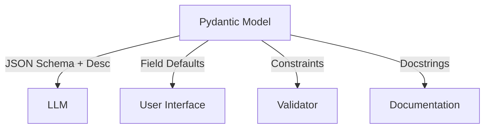

# Pydantic-First AI Engineering: The Schema-as-Contract Pattern

## The Philosophy

In traditional AI engineering, we often separate **prompts** (natural language instructions), **validation** (code that checks output), and **configuration** (user settings). This leads to redundancy, "drift" where code and prompts disagree, and bloated context windows.

**Pydantic-First AI** inverts this: **The data model is the single source of truth.**

Instead of writing a prompt that says "The headline must be 10-50 words," and a validator that checks `len(headline)`, we define a **smart type**. The schema *is* the prompt, the validation, and the documentation simultaneously.

---

## Core Concept: Schema as Contract

We treat the Pydantic model as a unified interface between the User, the LLM, and the System.



### The "Three-Layer Field"

Every field in your model should answer three questions, encoded directly in the `Field` definition:

| Question | Pydantic Component | Purpose |
|----------|-------------------|---------|
| **"What does 'good' look like?"** | `description="..."` | **Instruction**: Tells the LLM what to generate. |
| **"What are the hard rules?"** | `min_length=`, `pattern=`, `ge=` | **Success Criteria**: Defines valid output for the LLM and the validator. |
| **"What is the starting point?"** | `default=` | **Configuration**: Sets the UI default or safe fallback. |

### Example: The "Smart" Field

```python
from pydantic import BaseModel, Field, field_validator

class Insight(BaseModel):
    headline: str = Field(
        # 1. Configuration (User starts here)
        default="New Insight",
        
        # 2. Success Criteria (Hard constraints)
        min_length=10, 
        max_length=100,
        pattern=r"^[A-Z]",
        
        # 3. Instruction (The Prompt)
        description="A punchy, present-tense summary of the finding. Must start with a capital letter."
    )

    @field_validator("headline")
    @classmethod
    def fix_formatting(cls, v: str) -> str:
        """Embedded Intelligence: Auto-fix common LLM mistakes."""
        v = v.strip()
        if not v[0].isupper():
            v = v[0].upper() + v[1:] # Auto-capitalization
        return v
```

---

## Benefits

### 1. Token Efficiency & Clarity
Instead of a generic system prompt ("Extract items. Items should have headlines..."), the LLM receives a precise JSON schema with localized instructions.
*   **Traditional**: 1000 tokens of "prompt engineering" + separate JSON schema.
*   **Pydantic-First**: Schema *contains* the instructions. Zero redundancy.

### 2. Self-Healing Data (Embedded Intelligence)
Validators don't just reject bad data; they can fix it.
*   *Trim whitespace*
*   *Normalize dates*
*   *Auto-correct casing*
*   *Deduplicate lists*

This makes the system robust against minor LLM hallucinations.

### 3. UI/Config Synchronization
Because the model includes defaults and descriptions, you can auto-generate user interfaces directly from the class definition. If you update the prompt (description), the UI help text updates automatically.

---

## Implementation Guide

### Step 1: Define Semantic Types
Don't use `str` or `int` if you mean something specific.
*   **Bad**: `citation: str`
*   **Good**: `citation: CitationStr` (where `CitationStr` validates format `[Source, Date]`)

### Step 2: Rich Descriptions
Write `Field(description=...)` as if you are talking to the LLM.
*   **Weak**: `description="The summary"`
*   **Strong**: `description="A 3-sentence summary capturing the main conflict. Avoid starting with 'The article discusses'."`

### Step 3: PydanticAI Integration
Use [PydanticAI](https://ai.pydantic.dev/) to bind models to agents. The framework automatically converts your Pydantic models into the tool definitions or structured output schemas expected by the model.

```python
from pydantic_ai import Agent

agent = Agent(
    'anthropic:claude-3-5-sonnet-latest',
    result_type=Insight,  # The model IS the prompt
)
```

---

## Real-World Example: AI Enrichment Schema

The `DocumentEnrichment` model in the docpipe codebase demonstrates the pattern: **field descriptions as LLM instructions**.

### The Pattern

```python
from pydantic import BaseModel, Field

class DocumentEnrichment(BaseModel):
    """Output schema for Gemini enrichment. Field descriptions are Gemini's instructions."""

    ai_title: str = Field(
        description="Clear human-readable title. Include the district name, "
        "document type, and year range if apparent. "
        "E.g. 'Broward County School Calendar 2018-2019'"
    )
    ai_summary: str = Field(
        min_length=20,
        max_length=500,
        description="2-3 sentence summary of what this document covers "
        "and what policy areas it addresses.",
    )
    ai_document_type: NctqDocumentType = Field(
        description="Classification of document type. Choose from: "
        "salary_schedule, annual_calendar, evaluation_handbook, contract, "
        "union_document, benefits_handbook, board_policy, other."
    )
    ai_confidence: float = Field(
        ge=0.0, le=1.0,
        description="0.0-1.0 confidence in this enrichment. "
        "Low if text is garbled, very short, or ambiguous.",
    )
```

### What This Achieves

| Pydantic Feature | Role |
|-----------------|------|
| `Field(description=...)` | Prompt instruction to Gemini |
| `min_length=20, max_length=500` | Hard constraint enforced by both LLM and validator |
| `ge=0.0, le=1.0` | Numeric bounds in JSON schema → LLM respects them |
| `NctqDocumentType` enum | Closed set of options → LLM picks from allowed values |

The model IS the prompt. PydanticAI sends the JSON schema (with descriptions) to Gemini, and Gemini returns structured output that Pydantic validates.

---

## Resources

*   **[Pydantic Documentation](https://docs.pydantic.dev/)**: The core library for data validation. Focus on `Field`, `AfterValidator`, and `model_validator`.
*   **[PydanticAI Documentation](https://ai.pydantic.dev/)**: The framework for building production-grade agents with Pydantic.
    *   [Agents & Models](https://ai.pydantic.dev/agents/): How to bind models.
    *   [Results & Validation](https://ai.pydantic.dev/results/): Structured output patterns.
*   **[JSON Schema Mapping](https://docs.pydantic.dev/latest/concepts/json_schema/)**: Understand how Pydantic fields translate to the schema the LLM sees.

---

**Goal**: Write code where the data structure defines the behavior. If you delete the prompt text but keep the model, the system should still mostly work because the intent is baked into the types.