# 1. Start Here

If you are new to Compass, start here. This page answers the questions that tend
to come before the technical ones: What is Compass? Who is it for? What can it
answer? Where does its information come from? Which document should I read next?

## Compass in one minute

Compass is NCTQ's AI research assistant for questions about U.S. school-district
policy. A user can ask about a district, compare districts, look up a policy
metric, or ask what NCTQ has published or recommends. Compass returns a plain-
language answer with tables or other useful artifacts when appropriate, and links
the material claims back to the reviewed source data or documents behind them.

Compass is part of the broader NCTQ.AI platform. The product has three connected
applications:

| Part | What it does | Who usually sees it |
| --- | --- | --- |
| Public frontend | The chat window embedded in the [District Policy Pathfinder](https://www.nctq.org/district-policy-pathfinder/) and available as a standalone web experience | Teachers, district leaders, researchers, and other policy readers |
| Policy Advisor API | Plans a question, resolves it against the approved catalog, retrieves data, builds the answer, and streams the response | The frontend and approved integrations |
| NCTQ dashboard | Reviews conversations, quality results, data inventory, and operational signals | NCTQ staff and authorized reviewers |

All three applications read from the `compass` PostgreSQL schema. A separate
nightly data-preparation pipeline moves reviewed source data through validation
before it reaches the database. The applications do not hand-edit policy data
during a chat turn.

## The four ideas to keep in mind

1. **Compass answers from a bounded NCTQ data universe.** It is a closed system,
   not a general web search engine. It answers from reviewed policy data, approved
   NCES context, NCTQ publications, and managed NCTQ policy content. See [Data &
   the Databricks Platform](03-data-and-databricks.md#the-short-version).
2. **Facts and wording have different jobs.** Typed contracts, catalog rules,
   database queries, validators, and the renderer own factual correctness. Models
   help interpret language, make bounded choices, and sometimes polish wording.
   See [Product & Answer Flow](02-product-and-answer-flow.md#the-short-version).
3. **Missing data is reported, not silently filled.** A response can say that a
   topic was not reviewed, does not apply, is not addressed in the documents, or is
   outside the Pathfinder universe. Those are different states, not interchangeable
   ways of saying "no."
4. **Quality is an ongoing evidence loop.** Saved cases, checkable criteria,
   verdicts, staff feedback, and data-pipeline checks help the team find failures
   and keep them from disappearing after a fix. See [Quality &
   Evaluation](04-quality-and-evaluation.md#the-short-version).

## What people use Compass for

The exact answer depends on what NCTQ has reviewed and how the question is framed,
but the main jobs are:

- look up a district policy metric for a named academic year;
- compare districts or find a ranked set of districts;
- filter, sort, count, or trend results when the data supports that operation;
- ask a follow-up question about the current conversation;
- ask what NCTQ has written about a topic; and
- ask for NCTQ's published policy position, rationale, or exemplar policy.

Compass can return a direct reply or a clarifying question when a request is
ambiguous. It does not invent a district, metric, value, citation, or NCTQ position
to make an answer look complete.

## What Compass does not do

Compass does not browse the open web during a chat turn. It does not answer from
unreviewed material, combine a district fact with an NCTQ recommendation without
labeling the difference, or pretend that an older review is current. When the data
does not support a request, the answer should say what is missing and why.

The current limitations are documented in [Known Issues &
Limitations](09-known-issues-and-limitations.md), including the difference between
catching added facts and proving that every important fact was retained in polished
prose.

## How the parts fit together

This small diagram is an orientation aid, not the complete architecture. The full
map includes runtime context, the `compass` schema, Databricks and Data Factory,
model roles, Logfire, and the evaluation/feedback loop in the [Compass system
architecture reference](reference/architecture.md).

The important boundary is between the model's language work and the data work.
The planner may interpret a phrase such as "the largest districts," but ordinary
code resolves the phrase to real catalog fields, executes the query, and assembles
the cited result. The answer stylist can improve wording only within the rules
described in [Generation: facts first, phrasing second](02-product-and-answer-flow.md#generation-facts-first-phrasing-second).

## A quick route through the documentation

Use the question you are trying to answer to choose your next page. The linked
index below the diagram is the definitive navigation list; this picture is the
short orientation for a first-time reader.

```mermaid
flowchart TD
    START([What do you need to understand?])

    START --> PRODUCT["Product behavior<br/>How does a question become an answer?"]
    START --> DATA["Data and structure<br/>What does Compass know and where is it stored?"]
    START --> TRUST["Quality and limits<br/>How is trust measured and what remains imperfect?"]
    START --> TECH["Implementation<br/>Where are the code, API, and integrations?"]
    START --> ORIENT["Orientation and operations<br/>What do terms mean and where is the operational handoff?"]

    PRODUCT --> D2["§2 Product & Answer Flow"]
    DATA --> D3["§3 Data & the Databricks Platform"]
    DATA --> DS["Compass schema reference"]
    TRUST --> D4["§4 Quality & Evaluation"]
    TRUST --> D9["§9 Known Issues & Limitations"]
    TECH --> ARCH["System architecture reference"]
    TECH --> D8["§8 Technical Reference"]
    ORIENT --> DG["Compass glossary"]
    ORIENT --> D5["§5 Administration and Dashboard"]
    ORIENT --> D6["§6 Hosting, Deployment & Security"]
    ORIENT --> D7["§7 Costs, Accounts & Budget"]

    classDef start fill:#fef3c7,stroke:#b45309,stroke-width:2px,color:#111827
    classDef question fill:#dbeafe,stroke:#1d4ed8,stroke-width:2px,color:#111827
    classDef destination fill:#dcfce7,stroke:#15803d,stroke-width:2px,color:#111827

    class START start
    class PRODUCT,DATA,TRUST,TECH,ORIENT question
    class D2,D3,DS,D4,ARCH,D8,D9,DG,D5,D6,D7 destination
```

## Which document should I read?

| If your question is... | Read this next | It covers... |
| --- | --- | --- |
| What happens from a user question to a final answer? | [§2 Product & Answer Flow](02-product-and-answer-flow.md) | Planning, retrieval, execution, citations, answer structure, prompts, models, and voice |
| Where is the complete system architecture? | [System architecture reference](reference/architecture.md) | Pathfinder, frontend, API, Dashboard, PostgreSQL, runtime context, data refresh, models, Logfire, and evaluation |
| What data can Compass answer from, and what does "current" mean? | [§3 Data & the Databricks Platform](03-data-and-databricks.md) | Sources, coverage, nightly sync, bronze/silver/gold stages, data freshness, and known data gaps |
| How are tables, fields, relationships, and views organized? | [Compass schema reference](reference/compass-schema.md) | The `compass` PostgreSQL views, tables, columns, relationships, and sync ledgers |
| How do we know whether Compass is working? | [§4 Quality & Evaluation](04-quality-and-evaluation.md) | Quality dimensions, scenarios, cases, criteria, verdicts, sweeps, scorecards, and feedback |
| Where are the API, configuration, prompt, stack, and integration details? | [§8 Technical Reference](08-technical-reference.md) | API routes, environment names, application boundaries, prompt links, open-source credits, and Pathfinder embedding |
| What is still limited, imperfect, or under active improvement? | [§9 Known Issues & Limitations](09-known-issues-and-limitations.md) | Known gaps, workarounds, and improvements in progress |
| What does a term such as TCD, coverage state, or verdict mean? | [Compass glossary](reference/compass-glossary.md) | Plain-language definitions with links to the source documentation |
| Is Metric Calculator part of Compass? How does its data reach Compass? | [Metric Calculator reference](reference/metric-calculator.md) | An adjacent NCTQ system, not part of Compass, and the indirect path (via the TCD/Pathfinder database) its approved data takes to reach Compass |

Sections 5-7 cover administration, hosting/security, and service ownership plus
cost planning. They are operational handoff documents rather than prerequisites
for understanding the public product explanation.

## FAQ: questions a new reader is likely to ask

### What is the shortest accurate description of Compass?

An NCTQ-backed research assistant that answers questions about reviewed school-
district policy data and shows the sources and coverage behind its answers. For the
full answer flow, read [§2](02-product-and-answer-flow.md).

### Who is Compass for?

The public experience is for people who need to understand or compare district
teacher policies. NCTQ staff also use the dashboard and evaluation system to review
conversations, inspect data coverage, and improve the product. The same core data
and answer contracts support both audiences, but the dashboard is a staff tool, not
the public chat.

### Can I ask Compass anything about education policy?

You can ask about the districts, topics, years, and NCTQ materials in its reviewed
universe. If a concept is outside that universe, Compass should say so. [§3](03-data-and-databricks.md#what-compass-covers)
explains coverage, while [§2](02-product-and-answer-flow.md#planning-intent-becomes-a-typed-plan)
explains how requests are routed.

### Does Compass search the web when I ask a question?

No. The chat path reads the `compass` schema and approved local content. The
source systems and nightly pipeline are described in [§3](03-data-and-databricks.md#where-the-data-comes-from).

### Why does an answer mention an academic year?

Policy values belong to a review year, and supporting NCES information has its own
data vintage. Compass labels those dates rather than presenting every number as if
it were current. See [What "current" means](03-data-and-databricks.md#what-current-means).

### What does "not reviewed" mean? Is it the same as "not applicable"?

No. Coverage states distinguish a missing review, a topic that does not apply, an
issue the reviewed documents do not address, and a request outside the covered
universe. [What Compass covers](03-data-and-databricks.md#what-compass-covers) defines
the states and why the distinction matters.

### How does Compass keep a model from making up an answer?

The model does not supply the database identifiers, values, or citations used in a
data answer. A typed plan is reconciled against the catalog; deterministic code
fetches and renders the data; validation checks the result; and citations are
attached to the evidence rows. [§2](02-product-and-answer-flow.md#retrieval-phrases-become-verified-entities)
and [§4](04-quality-and-evaluation.md#answer-time-validation) describe those safeguards.

### What is the difference between a district fact and an NCTQ recommendation?

A district fact comes from the reviewed policy data and its source documents. An
NCTQ recommendation comes from NCTQ's published policy content. Compass routes and
labels those kinds of questions separately; [§3](03-data-and-databricks.md#where-the-data-comes-from)
shows the source boundaries.

### How do we know whether a change made Compass better?

The team replays saved cases against explicit criteria and records verdicts in an
append-only evaluation ledger. Staff feedback can add a new case when a real user
question exposes a gap. Read [§4 Quality & Evaluation](04-quality-and-evaluation.md#2-the-saved-scenario-library)
and [How a failure becomes a fix](04-quality-and-evaluation.md#6-from-a-failure-to-a-fix).

### Where can I see the tables and fields behind Compass?

Start with the [Compass schema reference](reference/compass-schema.md). It lists the
runtime views first, then the source, enrichment, and sync/audit tables. [§3](03-data-and-databricks.md#the-data-dictionary)
explains how those pieces fit the chat path.

### Where are the system prompts and instructions?

The system-prompt detail is intentionally not duplicated here. [§2's prompt
section](02-product-and-answer-flow.md#prompts-and-instructions-where-they-live-how-they-work)
explains the two instruction tiers, and [§8](08-technical-reference.md#prompts-and-instruction-references)
links to the current files and their history.

### What software made Compass possible?

The [open-source acknowledgements in §8](08-technical-reference.md#license-and-open-source-acknowledgements)
credit the major runtime, backend, database, dashboard, frontend, and tooling
projects. The manifests and lockfiles remain the complete dependency record.

### What should I read if I am reviewing the technical implementation?

Read this page first, then [§8 Technical Reference](08-technical-reference.md) and
the [System architecture reference](reference/architecture.md) and the [schema reference](reference/compass-schema.md).
If you need to understand
answer behavior rather than deployment or code boundaries, read [§2](02-product-and-answer-flow.md)
before §8.

### Where are administration, hosting, security, account-ownership, and budget questions answered?

[§5 Administration and Dashboard](05-administration-and-dashboard.md), [§6
Hosting, Deployment, and Security](06-hosting-deployment-security.md), and [§7
Costs, Accounts, and Budget](07-costs-accounts-and-budget.md) cover those
subjects as operational handoff documentation for NCTQ. They describe scope,
process, and ownership; live credentials, deployment identifiers, secrets, and
account access still live only in the approved secret manager and source
systems, not in this repository.

## Glossary

The [Compass glossary](reference/compass-glossary.md) is the shared vocabulary for
the documentation set. It starts with the terms in the client's outline, then adds
the names readers need to follow the answer pipeline and quality loop. If a term
has a precise database meaning, the glossary links to the schema reference rather
than trying to duplicate every column definition here.
