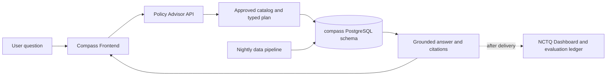

# 1. Start Here

If you are new to Compass, start here. This page answers the questions that tend
to come before the technical ones: What is Compass? Who is it for? What can it
answer? Where does its information come from? Which document should I read next?

## Compass in one minute

Compass is NCTQ's AI research assistant for questions about U.S. school-district
policy. A user can ask about a district, compare districts, look up a policy
metric, or ask what NCTQ has published or recommends. Compass returns a plain-
language answer with tables or other useful artifacts when appropriate, and links
the material claims back to the reviewed source data or documents behind them.

Compass is part of the broader NCTQ.ai platform. The product has three connected
applications:

| Part | What it does | Who usually sees it |
| --- | --- | --- |
| Compass Frontend | The chat window embedded in the [District Policy Pathfinder](https://www.nctq.org/district-policy-pathfinder/) and available as a standalone web experience | Teachers, district leaders, researchers, and other policy readers |
| Policy Advisor API | Plans a question, resolves it against the approved catalog, retrieves data, builds the answer, and streams the response | The frontend and approved integrations |
| NCTQ Dashboard | Reviews conversations, quality results, data inventory, and operational signals | NCTQ staff and authorized reviewers |

All three applications read from the `compass` PostgreSQL schema. A separate
nightly data-preparation pipeline moves reviewed source data through validation
before it reaches the database. The applications do not hand-edit policy data
during a chat turn.

## The four ideas to keep in mind

1. **Compass answers from a bounded NCTQ data universe.** It is a closed system,
   not a general web search engine. It answers from reviewed policy data, approved
   NCES context, NCTQ publications, and managed NCTQ policy content.
2. **Facts and wording have different jobs.** Typed contracts, catalog rules,
   database queries, validators, and the renderer own factual correctness. Models
   help interpret language, make bounded choices, and sometimes polish wording.
3. **Missing data is reported, not silently filled.** A response can say that a
   topic was not reviewed, does not apply, is not addressed in the documents, or is
   outside the Pathfinder universe. Those are different states, not interchangeable
   ways of saying "no."
4. **Quality is an ongoing evidence loop.** Saved cases, checkable criteria,
   verdicts, staff feedback, and data-pipeline checks help the team find failures
   and keep them from disappearing after a fix.

Each idea has a home section, listed in [Which document should I
read?](#which-document-should-i-read) below.

## What people use Compass for

The exact answer depends on what NCTQ has reviewed and how the question is framed,
but the main jobs are:

- look up a district policy metric for a named academic year;
- compare districts or find a ranked set of districts;
- filter, sort, count, or trend results when the data supports that operation;
- ask a follow-up question about the current conversation;
- ask what NCTQ has written about a topic; and
- ask for NCTQ's published policy position, rationale, or exemplar policy.

Compass can return a direct reply or a clarifying question when a request is
ambiguous. It does not invent a district, metric, value, citation, or NCTQ position
to make an answer look complete.

## What Compass does not do

Compass does not browse the open web during a chat turn. It does not answer from
unreviewed material, combine a district fact with an NCTQ recommendation without
labeling the difference, or pretend that an older review is current. When the data
does not support a request, the answer should say what is missing and why.

The current limitations are documented in [Known Issues &
Limitations](09-known-issues-and-limitations.md).

## How the parts fit together

This small diagram is an orientation aid, not the complete architecture. The
[system architecture reference](reference/architecture.md) has the full map,
including runtime context, the `compass` schema, Databricks and Data Factory,
model roles, Logfire, and the evaluation loop.

The important boundary is between the model's language work and the data work.
The planner may interpret a phrase such as "the largest districts," but ordinary
code resolves the phrase to real catalog fields, executes the query, and assembles
the cited result. The answer stylist can improve wording, never facts.

## Which document should I read?

Use the question you are trying to answer to pick your next page. This table is
the navigation list for the whole set.

| If your question is... | Read this next | It covers... |
| --- | --- | --- |
| What happens from a user question to a final answer? | [§2 Product & Answer Flow](02-product-and-answer-flow.md) | Planning, retrieval, execution, citations, answer structure, prompts, models, and voice |
| Where is the complete system architecture? | [System architecture reference](reference/architecture.md) | Two maps: the NCTQ.ai platform, including the systems outside Compass, and Compass itself in detail |
| Which models run, under which instructions, with which guardrails? | [Prompt and model inventory](reference/prompt-and-model-inventory.md) | Model roles and fallbacks, an index of every instruction asset, and how to read a prompt's version history |
| What data can Compass answer from, and what does "current" mean? | [§3 Data & the Databricks Platform](03-data-and-databricks.md) | Sources, coverage, nightly sync, bronze/silver/gold stages, data freshness, and known data gaps |
| How are tables, fields, relationships, and views organized? | [Compass schema reference](reference/compass-schema.md) | The `compass` PostgreSQL views, tables, columns, relationships, and sync ledgers |
| How do we know whether Compass is working? | [§4 Quality & Evaluation](04-quality-and-evaluation.md) | Quality dimensions, scenarios, cases, criteria, verdicts, sweeps, scorecards, and feedback |
| Where are the API, configuration, prompt, stack, and integration details? | [§8 Technical Reference](08-technical-reference.md) | API routes, environment names, application boundaries, prompt links, open-source credits, and Pathfinder embedding |
| What is still limited, imperfect, or under active improvement? | [§9 Known Issues & Limitations](09-known-issues-and-limitations.md) | Known gaps, workarounds, and improvements in progress |
| What does a term such as TCD, coverage state, or verdict mean? | [Compass glossary](reference/compass-glossary.md) | Short definitions, each pointing at the section that owns the detail |
| Is Metric Calculator part of Compass? How does its data reach Compass? | [Metric Calculator reference](reference/metric-calculator.md) | An adjacent NCTQ system, not part of Compass, and the indirect path its approved data takes to reach Compass |
| How does NCTQ staff monitor Compass, and who gets access? | [§5 Administration and Dashboard](05-administration-and-dashboard.md) | Dashboard purpose, sign-in and roles, API keys, review workflows, and failure ownership |
| How is Compass released, secured, observed, and recovered? | [§6 Hosting, Deployment, and Security](06-hosting-deployment-security.md) | Azure production, Coolify staging, release checklist, security boundaries, rollback, and incident response |
| Who owns and who pays for each external account, and what does Compass cost to run? | [§7 Costs, Accounts, and Budget](07-costs-accounts-and-budget.md) | Account-by-account administrator and payer, the credential register, handoff rules, the measured Azure baseline, and model-spend planning |

Sections 5-7 are operational handoff documentation for NCTQ rather than
prerequisites for understanding the product.

## FAQ: questions a new reader is likely to ask

Each answer is self-contained. Where you need more, the table above says which
section owns the subject.

### What is the shortest accurate description of Compass?

An NCTQ-backed research assistant that answers questions about reviewed
school-district policy data and shows the sources and coverage behind its
answers.

### Who is Compass for?

The public chat is for people who need to understand or compare district teacher
policies. NCTQ staff also use the Dashboard and the evaluation system to review
conversations, inspect data coverage, and improve the product. Both audiences rest
on the same data and answer contracts, but the Dashboard is a staff tool, not the
public chat.

### Can I ask Compass anything about education policy?

You can ask about the districts, topics, years, and NCTQ materials in its reviewed
universe. If a concept is outside that universe, Compass should say so rather than
improvise an answer.

### Does Compass search the web when I ask a question?

No. A chat turn reads the `compass` database schema and approved local content,
and nothing else.

### Why does an answer mention an academic year?

Policy values belong to a review year, and supporting NCES information has its own
data vintage. Compass labels those dates rather than presenting every number as if
it were current.

### What does "not reviewed" mean? Is it the same as "not applicable"?

No. Compass keeps five coverage states apart: data it has, a topic the reviewed
documents don't address, a topic that doesn't apply to that district, a district
NCTQ hasn't reviewed for that year, and a subject outside the reviewed universe
altogether. Collapsing them into one "no" would misrepresent the data.

### How does Compass keep a model from making up an answer?

A model never supplies the identifiers, values, or citations in a data answer. It
produces a typed plan; that plan is reconciled against NCTQ's catalog;
deterministic code fetches and renders the data; validation checks the result; and
citations are attached to the evidence rows the values came from.

### What is the difference between a district fact and an NCTQ recommendation?

A district fact comes from the reviewed policy data and its source documents. An
NCTQ recommendation comes from NCTQ's published policy content. Compass routes
those two kinds of question separately and labels which one an answer is giving.

### How do we know whether a change made Compass better?

The team replays saved cases against explicit criteria and records the verdicts in
an append-only ledger, so a claim of improvement points at evidence rather than at
one appealing example. Staff feedback can add a new case when a real user question
exposes a gap.

### Where are the system prompts and instructions?

They are markdown files in this repository, under
[`backend/src/compass_backend/instructions/`](../backend/src/compass_backend/instructions/).
The [prompt and model inventory](reference/prompt-and-model-inventory.md) indexes
every one of them, including the on-demand planner-guidance snippets. Because
they're versioned with the code, their git history is the prompt history.

### What is Compass forbidden to say, and what must it always disclose?

Both lists are in [§2 Product & Answer Flow](02-product-and-answer-flow.md): the
subjects and claims Compass declines, and the disclosures it must include —
among them the coverage sentences it reproduces verbatim, because each one marks
a distinct coverage state. Every rule is marked as mechanically enforced or
instruction-only.

### Where does Compass tend to get things wrong?

[§9 Known Issues & Limitations](09-known-issues-and-limitations.md) opens with
those patterns, ordered by how likely a reader is to hit each one, with the
evaluation evidence behind them.

### What software made Compass possible?

[§8 Technical Reference](08-technical-reference.md) credits the major runtime,
backend, database, dashboard, frontend, and tooling projects. The manifests and
lockfiles remain the complete dependency record.

### What should I read if I am reviewing the technical implementation?

Read this page, then [§2 Product & Answer Flow](02-product-and-answer-flow.md) for
answer behavior and [§8 Technical Reference](08-technical-reference.md) for code
and interface boundaries.

### Do these docs contain credentials or deployment identifiers?

No. Sections 5-7 describe operational scope, process, and ownership. Live
credentials, secrets, connection strings, and account access stay in the approved
secret manager and source systems.

## Glossary

The [Compass glossary](reference/compass-glossary.md) is the shared vocabulary for
this documentation set: short definitions for the product, data, answer-flow, and
quality terms these pages use. When a term has a precise database meaning, the
glossary points at the schema reference instead of restating a column definition.
