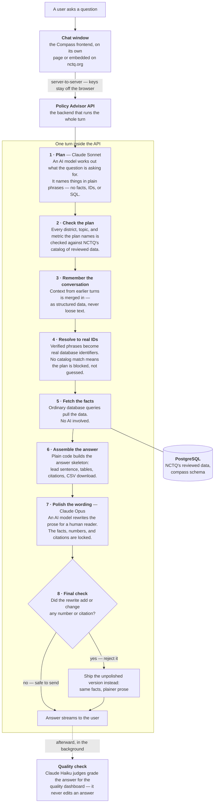

# 2. Product & Answer Flow

**How Compass turns a question into a grounded, cited answer.**

## The short version

When someone asks Compass a question — *"What's the starting teacher salary in
Denver?"* — the answer they get back is not something an AI model made up. Compass
works in separated stages: an AI model **plans** what the question is asking for; a
deterministic layer **verifies** that every district, topic, and metric in that plan
actually exists in NCTQ's catalog; plain database queries **fetch** the facts; a
renderer **assembles** the answer with its tables and citations; and only then does
an AI model **phrase** the result in plain language — under validation rules that
reject any rewrite that adds or changes a number. The facts and the wording come
from different places, on purpose.

Two properties fall out of this design:

- **Every value traces to a real database row.** Models never supply facts, IDs, or
  citations; they supply intent and phrasing.
- **Every answer shows its work.** Data cells carry citation markers that resolve to
  the actual source documents NCTQ reviewed.

The rest of this doc walks the pipeline in order, then covers the prompt
architecture and the voice standards. It assumes technical fluency from here on.

## The pipeline

Read the diagram top to bottom — each box is one stage, with a line on what it
does. The key thing to watch: an AI model appears at only three points (steps 1,
7, and the after-the-fact quality check), and never as the source of a fact.

A turn's stages in code: session load → planner → context merge and normalization →
catalog resolution → execution and rendering → persistence. The orchestration
entrypoint is `build_chat_response()` in
`src/compass_backend/orchestration/chat.py`, written as a table of contents over
named stage helpers — the stage order above is readable directly from it.

## Planning: intent becomes a typed plan

The planner (Claude Sonnet) is the single model authority for **what the question
is asking** — and nothing else. Its output is a typed `PlannerTurn` object, not
prose. It chooses one of five routes:

| Route | When | What happens next |
| --- | --- | --- |
| `execute` | A data question | A typed `QueryPlan` runs against the database |
| `clarify` | The question is ambiguous | Compass asks one grounded clarifying question |
| `policy_guidance` | "What does NCTQ recommend…" | Answered from NCTQ's published positions only |
| `publication` | "What has NCTQ written about…" | Answered from the publications catalog only |
| `direct` | Greetings, meta-questions | A direct reply, no data fetch |

Three rules keep planning safe:

- **No prose dispatch.** Nothing downstream branches on natural-language strings;
  routing happens on typed fields. A CI test enforces this with a
  shrinking baseline of grandfathered exceptions.
- **No minted identifiers.** The planner emits *phrases* ("Denver", "starting
  salary"); it cannot supply database IDs, SQL, or citations.
- **No silent re-rolls.** The planner runs with zero output retries. If its output
  fails validation, the turn becomes an honest clarifying question rather than a
  quietly regenerated plan.

District facts and NCTQ opinion are never mixed: district data answers come from the
policy dataset, and NCTQ's stances come only from its published positions, each with
its own route.

> **In flight:** today the planner must commit to one query shape before it has
> looked at the data; letting it explore the catalog first — with the same typed
> execution and the same grounding rules — is a known improvement under way. See
> [Known Issues & Limitations](09-known-issues-and-limitations.md#the-planner-picks-a-query-shape-before-it-sees-the-data).

## Retrieval: phrases become verified entities

> **A foundational concept for trusting the answers Compass gives.** Catalog
> resolution is a one-way door between language and data. Compass never acts on
> words: words are exchanged for catalog IDs before any data is touched, and
> everything after the exchange deals only in IDs. The picture to hold is a
> librarian and a writer. The librarian doesn't fetch a book by how well someone
> describes it. The description is exchanged at the card catalog for a call number,
> and the call number retrieves the exact book. The words inside that book are
> sacrosanct, delivered to the reader as printed: the writer may introduce and
> frame them, but not rewrite them. In Compass, the planner's phrases are the
> description, the catalog issues the call number, and the facts that come back are
> the book's contents, carried untouched through the tables, the citations, and the
> CSV download. A phrase the catalog can't exchange stops the plan: Compass asks a
> clarifying question or declines, rather than guessing, because a made-up thing
> has no ID and nothing runs without one. (District names make the exchange a
> little later than metrics and topics do, at query time rather than plan time, but
> the rule is the same everywhere.)

In code, the card catalog is the **CatalogResolver**. The planner's phrases carry
no authority of their own; the resolver turns them into real identifiers or blocks
the plan:

- District, metric, and topic phrases are reconciled against the catalog. Exact
  matches and curated aliases resolve in plain code; a genuinely ambiguous phrase
  goes to a bounded adjudicator (Claude Haiku) that may only choose among the
  candidates it is given and cannot add one of its own.
- Every resolution is recorded in a `CatalogResolutionReport` (phrase, method,
  approved IDs, candidates, blockers) and saved with the turn, so each answer
  carries its own audit trail.
- The coverage universe, the set of districts Compass can speak about at all,
  derives from the `district_profiles` view rather than from hardcoded lists or
  prompt text.
- Questions about concepts NCTQ hasn't reviewed (registered as out-of-universe
  aliases) are refused honestly instead of answered loosely.

The same discipline applies to NCTQ's supporting materials. A data answer can carry
NCTQ context (a relevant rationale, exemplar policy, or publication) as clearly
labeled asides, capped at two, each with its source link. Publications behave like
data: the renderer may only name publications the query actually fetched, and a
manifest validator rejects any cited title or URL outside that set.

## Generation: facts first, phrasing second

> **A foundational concept for trusting the answers Compass gives.** By this point
> the hard judgment calls are behind Compass. It knows what kind of question it is
> answering, and every district, metric, and topic has been exchanged for a
> verified catalog ID, so it knows exactly what it is working with. Building the
> answer is designed to involve as little decision-making as possible from here:
> the way to set an AI system up for success is to limit its options, and by
> answer time Compass has almost none left. Ordinary database queries fetch the
> facts. Plain code, with no AI model anywhere in it, lays them out as the answer:
> the lead sentence, the tables, the citation markers, the CSV download. Given the
> same plan and the same data, this stage produces the same result every time. In
> the librarian-and-writer picture, this is the moment between the two: the exact
> books are on the desk, and the answer is assembled straight from their pages
> before the writer writes a word. What comes out is a finished briefing prepared
> for the writer, facts checked and a source pinned to every value. The writer's
> turn is next, and wording is the only thing left in its hands.

In code, execution is deterministic: typed operations (lookup, ranking, count, trend, peer
comparison, and so on) run against read-only views of the `compass` schema. The
**renderer** — plain Python, no model — assembles the answer skeleton: a lead
sentence, data tables with a Sources column, coverage notes, and a downloadable CSV
artifact whose rows match the table exactly (same values, same citations; if there
are no rows, no CSV is offered).

Then the **answer stylist** (Claude Opus) rewrites the prose for a human reader.
It works inside a sealed brief: the facts, tables, caveat lines, and source blocks
are immutable, and the style guide's hard rules forbid adding facts, numbers, or
markers, rounding or computing values, or inventing NCTQ positions. Validation
enforces the contract mechanically:

- **Numeric-token provenance** — every number in the styled text must exist in the
  sealed facts; a rewrite that adds or changes a number is rejected.
- **Citation-marker integrity** — markers can't be invented or reattached.
- **Fallback, always available** — if the stylist times out or fails validation,
  the deterministic rendering ships instead. A styled answer is never required for
  correctness.

> **Direction of travel:** the target design gives the writing model the full
> answer artifact and adds a fact-*coverage* gate (verifying required facts are
> present, not just that nothing was invented). Today's guard is one-sided — it
> catches additions reliably; a rewrite could still thin out a fact that appears
> only in free prose. This is a known, tracked limitation (see
> [Known Issues](09-known-issues-and-limitations.md)).

## Citations

Citation markers are built by the executor from the evidence rows behind each data
cell — source document, page, URL — deduplicated by URL, and attached to the result
before any model sees the answer. The stylist cannot add or move them. Markers are
re-derived fresh on every turn from that turn's rows; there is no session-level
citation registry. The same citation columns ride along in the CSV export, so an
analyst opening the file offline still sees where every value came from.

## Answer structure

A Compass data answer has a consistent shape:

1. **Lead** — a direct answer to the question asked, echoing the user's terms.
2. **Coverage honesty before the data** — if something is missing (a district not
   reviewed this year, a topic not applicable), the answer says so *before* the
   table, in canonical phrasing that the stylist must preserve verbatim.
3. **The table** — with a Sources column of citation markers.
4. **Downloads** — a CSV of exactly the table's rows; charts when appropriate.
5. **Optional NCTQ aside** — at most two labeled, linked snippets of NCTQ guidance,
   and only when the answer has room for them.

Research and policy questions (`policy_guidance`, `publication` routes) return a
summary drawing only on NCTQ's published resources, with the same citation
discipline.

## Prompts and instructions: where they live, how they work

All model instructions are markdown files in this repository under
`src/compass_backend/instructions/`, loaded through one cached loader. Two tiers:

- **Base instructions — always on, one per agent.** `model_instructions/planner.md`
  (the planner's contract, routing rules, and examples), `judge.md` (quality
  judging), plus `answer_style_guides/default.md` (the stylist's voice and hard
  rules). The catalog adjudicator and other small agents have their own.
- **Planner guidance — on demand, selected per question.** Small topic snippets in
  `planner_guidance/` are chosen by a deterministic selector: word-boundary trigger
  phrases, blocked phrases, prior-route requirements, and priorities, capped at
  three snippets per question. Selected guidance is injected with an explicit
  warning that it carries no execution, catalog, or citation authority, and the
  selection is persisted with the turn for auditability.

The division of labor is strict: *facts live in code* (IDs, coverage truth,
selection rules, validators, renderer decisions); instruction files own phrasing,
routing judgment, and voice. A house style guide and lint tests keep the instruction
files consistent. Because the files are in git, their version history **is** the
prompt version history.

Which models run where (via the Pydantic AI Gateway, all Anthropic Claude):

| Stage | Model | Why |
| --- | --- | --- |
| Planner | Claude Sonnet | Fast, strong structured output for typed plans |
| Answer & clarification stylist | Claude Opus | Best writing quality for user-facing prose |
| Catalog adjudicator, quality judges | Claude Haiku | Small bounded judgments, high volume |

One operational consequence: if Anthropic has an outage, chat pauses even though
everything NCTQ hosts is healthy (provider status: status.claude.com). A separate
Google Gemini model appears only in the data-preparation pipeline (document
summaries, offline) — never in chat.

## Voice and tone

The voice standard lives in `answer_style_guides/default.md` and is summarized as a
*plain-spoken explainer talking to a policy reader who doesn't need to be eased into
the data*: lead with the answer, echo the user's words, name what's missing without
apology, offer one observation the data invites, use contractions, skip preambles
and promotional language. Coverage language is canonical and verbatim — for example,
*"Issue not addressed in the documents reviewed."* — so the same situation is always
described the same way. Internal jargon (metric slugs, "in-scope cells") is banned
from user-facing text. Voice is tuned by editing the style guide only, which is why
voice changes are expected to move zero accuracy scores.

## Quality, after the answer

Every turn is also judged after the response ships: a classifier selects the
relevant criteria and quality judges record pass/fail verdicts to an append-only
ledger. This is diagnostic — it powers the scorecard and the evaluation loop in
[Quality & Evaluation](04-quality-and-evaluation.md) — and never blocks or edits an
answer mid-turn.
