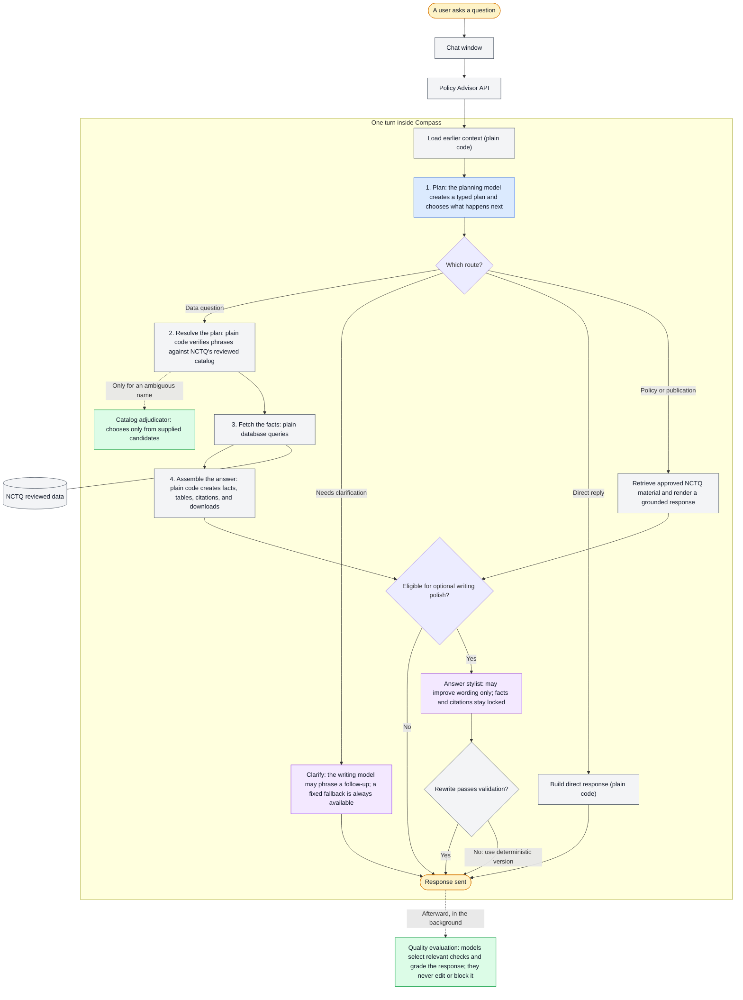

# 2. Product & Answer Flow

**How Compass turns a question into a grounded, cited answer.**

## The short version

When someone asks Compass a question (*"What's the starting teacher salary in
Denver?"*), the data in the answer is not something an AI model made up. Compass
works in separated stages: an AI model **plans** what the question is asking for; a
deterministic layer **verifies** that every district, topic, and metric in that plan
actually exists in NCTQ's catalog; plain database queries **fetch** the facts; a
renderer **assembles** the answer with its tables and citations; and, when a
response qualifies for polish, an AI model **phrases** the result in plain language,
under validation rules that reject a rewrite that adds or changes a number. The
facts and the wording come from different places, on purpose.

Two properties fall out of this design:

- **Every value traces to a real database row.** Models never supply facts, IDs, or
  citations; they supply intent and phrasing.
- **Every answer shows its work.** Data cells carry citation markers that resolve to
  the actual source documents NCTQ reviewed.

The rest of this doc walks the pipeline in order, then covers the prompt
architecture and the voice standards. It assumes technical fluency from here on.

## The pipeline

Read the diagram top to bottom. The central path is a data question; the short
branches show what happens when Compass instead needs clarification, can reply
directly, or retrieves approved NCTQ material. Color marks the division of labor:
blue plans, purple writes, green makes small bounded judgments, and gray boxes are
plain code. No AI box is ever the source of a fact. The diagram names roles rather
than models because the model for each role is a configuration setting, explained
in [How Compass uses different AI models](#how-compass-uses-different-ai-models).

A turn's stages in code: session load → planner → context merge and normalization →
catalog resolution → execution and rendering → persistence. The orchestration
entrypoint is `build_chat_response()` in
[`backend/src/compass_backend/orchestration/chat.py`](../backend/src/compass_backend/orchestration/chat.py),
written as a table of contents over named stage helpers; the stage order above is
readable directly from it.

## Planning: intent becomes a typed plan

The planner is the single model authority for **what the question is asking**, and
nothing else. Its output is a typed `PlannerTurn` object, not prose. It chooses one
of five routes:

| Route | When | What happens next |
| --- | --- | --- |
| `execute` | A data question | A typed `QueryPlan` runs against the database |
| `clarify` | The question is ambiguous | Compass asks one grounded clarifying question |
| `policy_guidance` | "What does NCTQ recommend…" | Answered from NCTQ's published positions only |
| `publication` | "What has NCTQ written about…" | Answered from the publications catalog only |
| `direct` | Greetings, meta-questions | A direct reply, no data fetch |

Three rules keep planning safe:

- **No prose dispatch.** Nothing downstream branches on natural-language strings;
  routing happens on typed fields. A repository test enforces this against a
  shrinking baseline of grandfathered exceptions.
- **No minted identifiers.** The planner emits *phrases* ("Denver", "starting
  salary"); it cannot supply database IDs, SQL, or citations.
- **No silent re-rolls.** The planner runs with zero output retries. If its output
  fails validation, the turn becomes an honest clarifying question rather than a
  quietly regenerated plan.

District facts and NCTQ opinion are never mixed: district data answers come from the
policy dataset, and NCTQ's stances come only from its published positions, each with
its own route.

> **In flight:** today the planner must commit to one query shape before it has
> looked at the data; letting it explore the catalog first, with the same typed
> execution and the same grounding rules, is a known improvement under way. See
> [Known Issues & Limitations](09-known-issues-and-limitations.md#the-planner-picks-a-query-shape-before-it-sees-the-data).

## Retrieval: phrases become verified entities

> **A foundational concept for trusting the answers Compass gives.** Catalog
> resolution is a one-way door between language and data. Compass never acts on
> words: words are exchanged for catalog IDs before any data is touched, and
> everything after the exchange deals only in IDs. The picture to hold is a
> librarian and a writer. The librarian doesn't fetch a book by how well someone
> describes it. The description is exchanged at the card catalog for a call number,
> and the call number retrieves the exact book. The words inside that book are
> sacrosanct, delivered to the reader as printed: the writer may introduce and
> frame them, but not rewrite them. In Compass, the planner's phrases are the
> description, the catalog issues the call number, and the facts that come back are
> the book's contents, carried untouched through the tables, the citations, and the
> CSV download. A phrase the catalog can't exchange stops the plan: Compass asks a
> clarifying question or declines, rather than guessing, because a made-up thing
> has no ID and nothing runs without one. (District names make the exchange a
> little later than metrics and topics do, at query time rather than plan time, but
> the rule is the same everywhere.)

In code, the card catalog is the **CatalogResolver**. The planner's phrases carry
no authority of their own; the resolver turns them into real identifiers or blocks
the plan:

- District, metric, and topic phrases are reconciled against the catalog. Exact
  matches and curated aliases resolve in plain code; a genuinely ambiguous phrase
  goes to a bounded AI adjudicator that may only choose among the candidates it
  is given and cannot add one of its own.
- Every resolution is recorded in a `CatalogResolutionReport` (phrase, method,
  approved IDs, candidates, blockers) and saved with the turn, so each answer
  carries its own audit trail.
- The coverage universe, the set of districts Compass can speak about at all,
  derives from the `district_profiles` view rather than from hardcoded lists or
  prompt text.
- Questions about concepts NCTQ hasn't reviewed (registered as out-of-universe
  aliases) are refused honestly instead of answered loosely.

The same discipline applies to NCTQ's supporting materials. A data answer can carry
NCTQ context (a relevant rationale, exemplar policy, or publication) as clearly
labeled asides, capped at two, each with its source link. Publications behave like
data: the renderer may only name publications the query actually fetched, and a
manifest validator rejects any cited title or URL outside that set.

## Generation: facts first, phrasing second

> **A foundational concept for trusting the answers Compass gives.** By this point
> the hard judgment calls are behind Compass. It knows what kind of question it is
> answering, and the metric and topic phrases have already been exchanged for
> verified catalog IDs. District names make their exchange right here, as the
> first step of running the query, and the card-catalog rule still holds: until a
> district name becomes a real ID, no data is fetched for it. Building the answer
> is designed to involve as little decision-making as possible from here: the way
> to set an AI system up for success is to limit its options, and by answer time
> Compass has almost none left. Ordinary database queries fetch the
> facts. Plain code, with no AI model anywhere in it, lays them out as the answer:
> the lead sentence, the tables, the citation markers, the CSV download. Given the
> same plan and the same data, this stage produces the same result every time. In
> the librarian-and-writer picture, this is the moment between the two: the exact
> books are on the desk, and the answer is assembled straight from their pages
> before the writer writes a word. What comes out is a finished briefing prepared
> for the writer, facts checked and a source pinned to every value. The writer's
> turn is next, and wording is the only thing left in its hands.

In code, execution is deterministic: typed operations (lookup, ranking, count, trend, peer
comparison, and so on) run against read-only views of the `compass` schema. The
**renderer** (plain Python, no model) assembles the answer skeleton: a lead
sentence, data tables with a Sources column, coverage notes, and a downloadable CSV
artifact whose rows match the table exactly (same values, same citations; if there
are no rows, no CSV is offered).

When a response qualifies for polish, the **answer stylist** rewrites the prose for
a human reader. It works inside a sealed brief: the facts, tables, caveat lines, and
source blocks are immutable, and the style guide's hard rules forbid adding facts,
numbers, or markers, rounding or computing values, or inventing NCTQ positions.
Validation enforces the contract mechanically:

- **Numeric-token provenance:** every number in the styled text must exist in the
  sealed facts; a rewrite that adds or changes a number is rejected.
- **Citation-marker integrity:** markers can't be invented or reattached.
- **Fallback, always available:** if the stylist times out or fails validation,
  the deterministic rendering ships instead. A styled answer is never required for
  correctness.

> **On the punch list:** two related items live in
> [Known Issues & Limitations](09-known-issues-and-limitations.md) — today's final
> check catches added facts but not dropped ones (and how sealing mitigates that),
> and the planned upgrade to a writer that composes from the full data behind a
> fact-coverage gate.

## Citations

The executor builds citation markers from the evidence rows behind each data cell
(source document, page, URL), deduplicates them by URL, and attaches them to the
result before any model sees the answer. The stylist cannot add or move them. Markers are
re-derived fresh on every turn from that turn's rows; there is no session-level
citation registry. The same citation columns ride along in the CSV export, so an
analyst opening the file offline still sees where every value came from.

## Answer structure

A Compass data answer has a consistent shape:

1. **Lead:** a direct answer to the question asked, echoing the user's terms.
2. **Coverage honesty before the data:** if something is missing (a district not
   reviewed this year, a topic not applicable), the answer says so *before* the
   table, in canonical phrasing that the stylist must preserve verbatim.
3. **The table:** with a Sources column of citation markers.
4. **Downloads:** a CSV of exactly the table's rows; charts when appropriate.
5. **Optional NCTQ aside:** at most two labeled, linked snippets of NCTQ guidance,
   and only when the answer has room for them.

Research and policy questions (`policy_guidance`, `publication` routes) return a
summary drawing only on NCTQ's published resources, with the same citation
discipline.

## Prompts and instructions: where they live, how they work

All model instructions are markdown files in this repository under
[`backend/src/compass_backend/instructions/`](../backend/src/compass_backend/instructions/),
loaded through one cached loader. Two tiers:

- **Base instructions: always on, one per agent.**
  [`model_instructions/planner.md`](../backend/src/compass_backend/instructions/model_instructions/planner.md)
  (the planner's contract, routing rules, and examples),
  [`judge.md`](../backend/src/compass_backend/instructions/model_instructions/judge.md) (quality
  judging), plus
  [`answer_style_guides/default.md`](../backend/src/compass_backend/instructions/answer_style_guides/default.md)
  (the stylist's voice and hard rules). The catalog adjudicator and other small
  agents have their own.
- **Planner guidance: on demand, selected per question.** Small topic snippets in
  [`planner_guidance/`](../backend/src/compass_backend/instructions/planner_guidance/)
  are chosen by a deterministic selector: word-boundary trigger
  phrases, blocked phrases, prior-route requirements, and priorities, capped at
  three snippets per question. Selected guidance is injected with an explicit
  warning that it carries no execution, catalog, or citation authority, and the
  selection is persisted with the turn for auditability.

The division of labor is strict: *facts live in code* (IDs, coverage truth,
selection rules, validators, renderer decisions); instruction files guide phrasing,
routing judgment, and voice. Python owns dynamic context and the deterministic
selection of any planner guidance. A house style guide and lint tests keep the
instruction files consistent. Because the files are in git, their version history
**is** the prompt version history.

> **Why this is split up:** Compass did not begin with this design. Early versions
> asked one model to understand the question, find the data, cite it, explain it,
> and write the answer. Later versions separated intake, research, writing, and
> review. The current design keeps models for bounded language work, but puts facts,
> coverage, citations, query rules, and required answer sections in typed contracts
> and ordinary code. That makes the initial model context smaller and easier to
> review, but the main benefit is reliability: changing prose guidance cannot
> silently change what Compass is allowed to claim. See
> [Prompt and instruction history](research/compass-prompt-history/README.md) for
> the full evolution, preserved prompt extracts, and the lessons from each redesign.

## Guardrails: what Compass must not say, and what it must always say

The rules above are architectural. This section collects the explicit
behavioral guardrails in one place: the subjects Compass declines, the claims it
is forbidden to make, and the disclosures it is required to include. Each rule
below lives in a versioned instruction file, a validator, or both — the
right-hand column says which, because that is the difference between a rule
that is enforced and a rule that is merely instructed.

### Subjects and requests Compass declines

| Guardrail | How it holds |
| --- | --- |
| **No outside sources.** Compass does not browse the web or call a source API during a turn. It answers only from the `compass` schema and approved local content. | Enforced in code: no web-search or browsing tool exists in the backend. |
| **No answers outside the reviewed universe.** Concepts NCTQ has not reviewed (teacher induction, for example) are registered as out-of-universe aliases and refused honestly rather than answered loosely. | Enforced in code: the catalog cannot resolve them, and nothing runs without an ID. |
| **No NCTQ opinion beyond NCTQ's published positions.** Compass does not generate policy recommendations, editorialize, or infer a stance NCTQ has not published. | Instructed and bounded: NCTQ positions come only from the approved content library, on their own route; the stylist may use only the sealed snippets it is handed. |
| **No implied position where none exists.** The stylist may not imply NCTQ has a stance on a topic the supplied snippet does not cover, and may not paraphrase NCTQ findings that are not in a snippet. | Instructed (style guide hard rules), with the snippet set itself capped and supplied by code. |
| **No invented entities.** No district, metric, value, citation, source marker, publication, or exemplar that is not in the sealed artifact. | Enforced: numeric-token provenance and citation-marker integrity checks reject the rewrite; the publication manifest validator rejects any title or URL outside the fetched set. |
| **No new arithmetic.** The stylist quotes values exactly as they appear and may not round, abbreviate, or compute a new number — to highlight a gap it quotes both endpoints rather than the difference. | Enforced for added or altered numbers by the numeric-token check; instructed for the "quote both endpoints" phrasing. |
| **No internal vocabulary in user-facing text.** Metric slugs, "in-scope cells", "issue-not-addressed" as a label, validator and route names, artifact IDs, schemas, and trace references are banned from answer prose. | Instructed: an explicit substitution table in the style guide. |
| **No overclaiming coverage.** An answer may not imply complete coverage when the artifact says coverage is partial, not reviewed, prior-year, not applicable, out of universe, or unsupported. | Instructed, with the underlying caveat lines sealed as immutable so a rewrite cannot delete them. |
| **No denying an attached artifact.** When a chart or CSV export is attached, the answer may not tell the user Compass cannot produce one. | Instructed, driven by the artifact list the renderer supplies. |

### Disclosures Compass is required to include

The coverage sentences are **canonical strings, reproduced verbatim**. This is
the point worth understanding: these are not suggested phrasings. Each one
marks a distinct coverage state, and rewording one into a friendlier
generality ("no data on file", "couldn't find data") destroys the distinction
the reviewed data actually makes. The stylist is required to carry them through
unchanged.

| Required disclosure | The rule |
| --- | --- |
| Issue not addressed in the reviewed documents | Exactly *"Issue not addressed in the documents reviewed."* |
| Topic does not apply to a district | Exactly *"Not applicable for [District]"* |
| Latest review is from a prior year | Exactly *"NCTQ last reviewed [District] for [subject] in [year]; the value then was [X]"* — the year is never dropped |
| Districts awaiting review | Exactly *"[N] districts haven't been reviewed for [year] yet"* — it counts districts, never data points |
| District outside the covered universe | Exactly *"[District, State] is not in the District Policy Pathfinder."* |
| NCTQ has no stance on the topic | The framing *"NCTQ does not currently have a policy stance on this topic"*, rather than *"I couldn't find NCTQ content"* |

Four more required disclosures are structural rather than verbatim:

- **Coverage comes before the data, not after.** When part of a request cannot
  be answered, the gap is stated in the opening prose, above the table — not
  buried beneath it.
- **The limitation is about the data, not the user.** A gap is described as
  missing reviewed data, never as a malformed question.
- **Every displayed value carries its source.** Data cells carry citation
  markers, the CSV export carries the same citation columns, and a cited NCTQ
  position must include its source URL as a link.
- **Years are labeled, always.** Policy values are labeled with their review
  year, and NCES context carries its own federal data vintage. When a salary
  lane is not specified and the catalog applies the reviewed BA default, the
  renderer discloses that choice.

The authoritative text for all of it is
[`answer_style_guides/default.md`](../backend/src/compass_backend/instructions/answer_style_guides/default.md)
(hard rules, coverage strings, NCTQ-context policy, jargon substitutions) and
[`model_instructions/planner.md`](../backend/src/compass_backend/instructions/model_instructions/planner.md)
(routing and refusal behavior). The mechanical enforcement lives in
[`answer_layer/validation.py`](../backend/src/compass_backend/answer_layer/validation.py).
Voice and tone standards, which are guidance rather than guardrails, are
[below](#voice-and-tone).

## How Compass uses different AI models

Compass uses different AI models for different jobs inside a single turn. The model
that interprets the question is not the one that polishes the final wording or
grades quality afterward. The current default assignments are Anthropic Claude
models, routed through the Pydantic AI Gateway:

| Role | What it does | Default model |
| --- | --- | --- |
| Planner | Interprets the question and produces the typed plan. | Claude Sonnet 4.6 |
| Answer and clarification stylist | Optionally polishes validated text or phrases a follow-up question. | Claude Opus 4.6 |
| Catalog adjudicator | Chooses among supplied candidates when a name is ambiguous. | Claude Haiku 4.5 |
| Criterion classifier and quality judges | Select relevant checks and grade the response after it ships. | Claude Haiku 4.5 |

For the complete role-by-role inventory of instruction files, guardrails, and
failure fallbacks, see the [prompt and model inventory](reference/prompt-and-model-inventory.md).

The reasoning behind the split:

- Planning gets the strongest model for structured reasoning. This is the
  highest-stakes model step: a wrong route or invalid plan sends the rest of the
  turn down the wrong path.
- Small, bounded judgments get a small, fast model. The adjudicator, classifier,
  and judges only choose among options Compass supplies, so speed and cost matter.
- Writing polish is optional by design. If the stylist fails, times out, or its
  rewrite fails validation, the deterministic validated answer ships instead. The
  clarification stylist also has a fixed fallback question.
- Any role can change models without changing the system. Each role is an
  independent setting, so a candidate model is evaluated for that job and adopted
  only if it performs better on the relevant reliability, quality, speed, and cost
  measures.

## Voice and tone

The voice standard lives in
[`answer_style_guides/default.md`](../backend/src/compass_backend/instructions/answer_style_guides/default.md)
and is summarized as a
*plain-spoken explainer talking to a policy reader who doesn't need to be eased into
the data*: lead with the answer, echo the user's words, name what's missing without
apology, offer one observation the data invites, use contractions, skip preambles
and promotional language. Coverage language is canonical and verbatim (for example,
*"Issue not addressed in the documents reviewed."*), so the same situation is always
described the same way. Internal jargon (metric slugs, "in-scope cells") is banned
from user-facing text. Voice is tuned by editing the style guide only, which is why
voice changes are expected to move zero accuracy scores.

## Quality, after the answer

Every turn is also judged after the response ships: a classifier selects the
relevant criteria and quality judges record pass/fail verdicts to an append-only
ledger. This is diagnostic: it powers the scorecard and the evaluation loop in
[Quality & Evaluation](04-quality-and-evaluation.md), and it never blocks or edits
an answer mid-turn.
