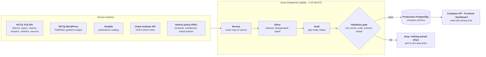
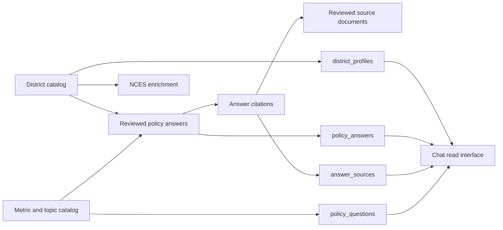

# 3. Data & the Databricks Platform

**What data Compass covers, where it comes from, how it's structured, and how it
stays current.**

## The short version

Compass is a **closed system**. It answers only from data that NCTQ has reviewed and
loaded into its own database. It does not browse the web, and no model call during
a chat turn ever reaches an outside source. Behind that database sits a
data-preparation platform (Azure Databricks) that collects the source data every
night, cleans and validates it, and pushes finished tables into the production
PostgreSQL database that all three Compass applications read.

That nightly pipeline is the only way data changes. Applications never write policy
data, staff never hand-edit production, and every push is validated, audited, and
reported before it lands.

## What Compass covers

The data universe, in orders of magnitude. Exact counts move as NCTQ's review work
continues, so this table deliberately avoids them; the dashboard's live data
inventory, which reads straight from the database, is the authority for current
figures.

| What | Scale |
| --- | --- |
| Districts reviewed by NCTQ | Large school districts spanning all 50 states and D.C. |
| Policy topics | About two dozen |
| Academic years | Every school year from 2015-16 through the current one |
| Reviewed policy answers | Tens of thousands |
| Source documents behind those answers | Thousands |
| NCTQ publications available to chat | Hundreds |
| NCES district directory (context data) | Nearly every U.S. public school district |

Coverage is honest by construction. Every district × topic × year cell carries one
of five coverage states (`covered`, `issue not addressed`, `not applicable`,
`not reviewed`, or `out of universe`), and answers label missing data instead of
papering over it. Concepts NCTQ has not reviewed (for example, teacher induction)
are registered explicitly as out-of-universe so Compass refuses them cleanly rather
than answering loosely.

## Where the data comes from

Each source, what Compass gleans from it, and its role:

| Source | What it provides | Role |
| --- | --- | --- |
| **NCTQ TCD API** | The core policy dataset: districts (with enrollment, FRPL, bargaining status), topics and their metrics, reviewed answers per district/metric/year, and the citations linking each answer to its source documents | **Answer source:** this is where district facts come from |
| **District policy documents** (PDFs) | The contracts, handbooks, and board policies NCTQ reviewed; a document pipeline extracts their text and metadata so answers can cite them | **Citation source:** they back answers; Compass does not free-read them at chat time |
| **Urban Institute / NCES** | Federal district data: enrollment, locale, staffing, finance | **Answer source, allowlisted:** only explicitly approved fields are user-facing, each with a governed citation URL |
| **Airtable publications catalog** | NCTQ's published reports and analyses | **Answer source for "what has NCTQ written" questions only,** never for district facts |
| **NCTQ WordPress (Pathfinder)** | Pathfinder guidance content | **Reference/audit copy:** the website remains authoritative; chat does not answer from it |
| **NCTQ policy positions** (git-managed content) | NCTQ's stances, rationales, and exemplar policies for a curated set of topics | **Answer source for "what does NCTQ recommend" questions only,** never mixed into data answers except as labeled asides |

The closed-system rule, stated precisely: the chat path reads only the `compass`
schema's tables and materialized views. No backend code calls a source API during a
turn, and no web-search or browsing tool exists in the backend.

## The nightly pipeline

The Databricks platform (several dozen notebooks organized by function, scheduled by
Azure Data Factory) runs every night on a fixed order: copy the NCTQ research
database → track row-level changes → build and push the Compass dataset → export the
website tables. Data moves through four stages, and never skips one:

| Stage | Rule |
| --- | --- |
| **Bronze** | Exact copy of the source; malformed rows stay malformed here |
| **Silver** | Cleaned, deduplicated, joined, typed; business rules applied |
| **Gold** | Exactly the columns, keys, and shape the applications expect |
| **Production** | Written by the push notebook; what the applications read |

The push itself runs five phases (prepare, upsert, refresh materialized views,
audit, report) and stops entirely if any phase fails, so production is never left
half-updated. Before anything is written, a validation gate checks row counts
against last-known-good (a drop over five percent fails the run), null and
uniqueness constraints, and schema shape. Every completed push writes audit rows
recording exactly what was inserted, updated, and deleted, and sends the data team a
plain-English report with the full SQL log attached.

A separate document pipeline processes the policy PDFs behind citations: text
extraction, classification, and AI-generated summaries (the pipeline's one use
of a non-Anthropic model, Google Gemini, entirely offline). Every document is
content-hashed so nothing is reprocessed unless it changes. Thousands of PDFs have
been through it.

The [Databricks notebook inventory](reference/databricks-notebook-inventory.md)
records the nine folders and 47 notebooks requested in the client outline, along
with each notebook's purpose, pipeline order, inputs, outputs, and owner. It is
based on the July 6, 2026 handoff source and marks workspace names or owners that
the source did not supply as items to verify against Databricks and Azure Data
Factory. Runbooks, alerting details, and credentials remain operational concerns;
this public reference contains no secrets. One scope note: the
**[Metric Calculator](reference/metric-calculator.md)** is a previous, parallel
data-ingestion project and is not part of Compass; its data is kept in the same
bronze/silver/gold layers, and reaches Compass only indirectly, through NCTQ's
published TCD/Pathfinder database — see the linked reference for the full path
and why it's out of scope for this documentation.

## The data dictionary

The `compass` schema divides into runtime views the chat reads, the tables behind
them, and governance/ledger tables. The authoritative definitions are maintained
in the source repository's data-sync package (`compass_schema.sql`,
`compass_views.sql`, and append-only migrations); this is the map:

For the field-level reference, relationships, types, and purposes, see the linked
[Compass schema reference](reference/compass-schema.md). This section keeps the
orientation at the system level; the reference is the place to look up an
individual table or field.

The runtime views (`district_profiles`, `policy_questions`, `policy_answers`, and
`answer_sources`) are the stable, denormalized read interface for chat. The source
tables retain upstream detail, sync metadata, citations, enrichment, and governed
configuration. The presence of a field in the database does not by itself make it
user-facing: route-specific logic and governed allowlists decide which fields may
appear in an answer.

**Runtime materialized views (what a chat turn reads):**

- `district_profiles`: one row per covered district, with TCD attributes joined to
  NCES context and an enrollment-authority override. This view *is* the coverage
  universe.
- `policy_questions`: the metric catalog (topics, subtopics, metrics).
- `policy_answers`: the reviewed answers, one per district/metric/year.
- `answer_sources`: the citation joins from answers to source documents.

**Governance tables (staff-reviewed configuration):** the NCES field allowlist,
curated catalog aliases, district normalization rules, peer-scoring policies, and
topic-content links. Several carry an explicit `review_status`
(`approved`/`candidate`/`rejected`) column; staff review is encoded in the data,
not in someone's memory.

**Ledgers (append-only history):** sync run records and audit rows for every push,
plus the evaluation ledger (scenarios, cases, criteria, verdicts) described in
[Quality & Evaluation](04-quality-and-evaluation.md).

## What "current" means

- The current academic year is a single constant in the backend
  (`2024-25` at the time of writing), enforced by a test that forbids year literals
  anywhere else in the code.
- Answers serve the **latest reviewed value, labeled with its year**. If a district
  was last reviewed in an earlier year, Compass says so, in canonical phrasing:
  *"NCTQ last reviewed [District] for [subject] in [year]; the value then was [X]."*
- Rankings never mix years; districts with only prior-year values become narrative
  mentions rather than table rows.
- NCES data lags by design, on federal release schedules: directory year 2022 and
  finance year 2020 at the time of writing. Each district row carries those years
  explicitly so answers can label them.

## How content gets added or updated

| Change | How it happens | Reviewed by staff? |
| --- | --- | --- |
| New or updated policy answers | NCTQ's review work lands in TCD; the nightly sync carries it through bronze→silver→gold→production | Yes; the review *is* the NCTQ process |
| New publications | Added to the Airtable catalog (a "for chatbot" flag controls inclusion); the sync mirrors it | Yes; curated in Airtable |
| New source documents | PDFs enter the document pipeline; summaries and classifications are validated before publishing to the catalog | Automated with validation gates |
| Catalog vocabulary (aliases, allowlists) | Database migrations in this repo, with `review_status` columns | Yes; code review plus status columns |
| Schema changes | Append-only numbered migrations in `src/compass_data_sync/migrations/` | Yes; code review |

Nothing is hand-edited in production, and removals are soft (rows are flagged, not
deleted) so history survives.

## Known gaps in the data

Stated here because honesty about coverage is a product feature:

- FRPL (free/reduced-price lunch) percentages are unavailable from the federal CCD
  source used for NCES context; that field is null pending an alternate source.
- A small share of covered answers have no fallback citation document.
- NCES context lags the current academic year by federal release schedules, as noted
  above.

The living list of issues and limitations across the whole product is
[Known Issues & Limitations](09-known-issues-and-limitations.md).
