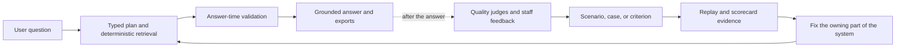

# 4. Quality & Evaluation

**How Compass knows whether an answer is grounded, accurate, and useful — and how a failure becomes a fix.**

> **A living reference, not a live dashboard.** This section describes the
> quality model itself. It deliberately does not state a current scenario count
> or a current overall accuracy result; those should come from a fresh, dated
> ledger export rather than an old note.

## The short version

Compass quality is not one score and it is not one kind of test. We use three
related layers:

1. **Answer-time safeguards** protect the answer being returned. The application
   retrieves typed data, builds a grounded result, checks the result, and falls
   back to a deterministic answer when an optional rewrite fails validation.
2. **Saved benchmark evaluations** test known questions repeatedly before and
   between releases. They tell us whether a change improved or regressed a
   particular kind of behavior.
3. **Post-launch monitoring and staff feedback** show us what real users are
   asking and which failures the benchmark does not yet cover.

The aim is twofold: Compass should not say something that is unsupported by the
reviewed NCTQ data, and it should follow the instructions for how that data must
be selected, labeled, cited, explained, and formatted. When those aims conflict
with convenience, grounded correctness wins.

The first path is a product safety path. The second path is an evaluation and
learning path. They inform each other, but a background evaluation verdict is
not a pre-send approval gate: the current quality judges record diagnostic
results after the response has shipped and do not edit or block it. See
[Product & Answer Flow](02-product-and-answer-flow.md) for the answer pipeline.

## 1. What we mean by quality

For a policy answer, “correct” has more than one meaning. A response can contain
real numbers and still be wrong because it used the wrong districts, ignored a
filter, mislabeled a gap in coverage, sorted the results incorrectly, or cited a
source that does not support the claim. It can also be factually sound but
misleading if its table, prose, and download disagree.

The durable quality model therefore evaluates seven accuracy dimensions:

| Dimension | The question it asks |
| --- | --- |
| **Selection** | Did Compass choose the right districts, metrics, peers, and years? |
| **Data fidelity** | Do the values, counts, denominators, and labels match the reviewed source data? |
| **Coverage-state labeling** | Did the answer distinguish covered data from “issue not addressed,” “not reviewed,” “not applicable,” or “out of universe”? |
| **Filtering** | Did it honor every constraint in the user’s question? |
| **Sorting** | Is the ordering correct, including ties and the requested direction? |
| **Citation** | Can each material claim and data cell be traced to a real supporting source? |
| **Consistency** | Do the lead, prose, table, citations, follow-up answer, and export agree? |

**Voice & tone** is a separate cross-cutting quality lens. It asks whether the
answer is plain-spoken, direct, appropriately qualified, and consistent with the
house style. It is not an eighth accuracy dimension: a voice change should not
silently change accuracy scores. The style standard is summarized in
[Product & Answer Flow](02-product-and-answer-flow.md#voice-and-tone).

These dimensions describe what a good answer must do. They do not by themselves
tell us whether a particular answer passed; that requires a saved question, an
explicit expected behavior, and a recorded evaluation.

## 2. The saved scenario library

The benchmark is a library of questions that we keep so the system can be tested
again after a code, data, instruction, or model change. A saved item is more than
a prompt copied into a spreadsheet. It should preserve the context needed to
reproduce the test and explain what success means.

The working vocabulary is:

- A **scenario** is a user goal or behavior family, written in plain language.
  It defines the situation we care about, such as a ranking question, a coverage
  question, a follow-up, or a request that Compass must refuse.
- A **case** is a runnable version of that scenario: the literal prompt, any
  required conversation context, the expected route or answer shape, and the
  source/data assumptions needed to replay it.
- A **criterion** is one checkable rule for a case. Criteria are deliberately
  narrow: for example, “the answer applies the requested year filter,” “the
  coverage caveat is present,” or “every displayed value has a supporting
  citation.” One case can have several criteria across several dimensions.
- A **verdict** is the recorded result for one answer and one criterion. It keeps
  the answer, criterion, time, evaluation path, and outcome together so a result
  can be audited rather than reduced to an unexplained percentage.
- A **sweep** is a named run that replays a set of cases and writes its verdicts
  to the evaluation ledger. Repeated runs are retained; they are evidence over
  time, not a replacement of history.
- A **scorecard** rolls those verdicts up so the team can see performance by
  dimension, scenario, case, and run. A roll-up is a useful signal, not a claim
  that every untested question is safe.

The intended source of truth is the append-only evaluation ledger: scenarios,
cases, criteria, verdicts, and sweep runs. A spreadsheet or dashboard can be a
review surface, but it should not become a second, conflicting definition of
what a scenario means.

Good scenarios are kept when they expose a meaningful behavior, not simply
because they are easy to grade. They should include ordinary questions,
boundary cases, refusal/out-of-scope cases, follow-ups, and examples from real
staff or user feedback. When a failure is fixed, the literal prompt or a faithful
equivalent should remain in the library as a regression case. When the underlying
data, product contract, or expected behavior changes, the case should be
reviewed and versioned rather than silently rewritten to make a new result look
better.

The current count is intentionally omitted from this document. The number changes
as scenarios are added, retired, split, or deduplicated, and the documentation
should report it only alongside the date, active/inactive definition, and ledger
query that produced it.

## 3. How Compass runs evaluations

There are several ways to evaluate Compass. They answer different questions and
their results should not be mixed as if they were one benchmark.

| Evaluation method | What it tells us | What it does not prove |
| --- | --- | --- |
| **Answer-time validation** | Whether the current response conforms to known grounding, shape, citation, and data-integrity rules before it is rendered and delivered | That the response is good on every semantic or stylistic dimension |
| **Background quality judging** | Which criteria appear to pass or fail on real conversations after delivery | That a judge’s verdict is always correct, or that the answer was blocked before a user saw it |
| **Saved-case sweep** | Whether the current system reproduces expected behavior across a fixed set of cases | That unrepresented questions or new data conditions will behave the same way |
| **Targeted replay and judge calibration** | Whether a change came from the product or from the evaluator itself | A clean product comparison if the case, data, prompt, or judge changed at the same time |
| **Human review and staff feedback** | Whether the benchmark reflects real user needs and whether a grader missed context | A reproducible aggregate score unless the observation becomes a saved case and criterion |
| **Data-pipeline validation** | Whether the inputs and nightly data push meet source, schema, row-count, and integrity expectations | Whether the conversational answer used those inputs correctly |

### Answer-time validation

The product’s strongest protections are deterministic. Compass does not ask a
model to invent a number, district identifier, or citation. The typed plan is
executed against the approved data, and the writer assembles the result and its
citations from that validated artifact. A final check rejects added or changed
facts that are not in the sealed result; if an optional rewrite fails, the
validated deterministic answer is returned instead.

This protection is intentionally narrower than a complete reading-comprehension
test. The current final check is much better at catching an added or altered
number than at proving that every important nuance was retained in free prose.
The known limitation and the planned fact-coverage gate are documented in
[Known Issues & Limitations](09-known-issues-and-limitations.md#the-final-check-catches-added-facts-not-dropped-ones).

### Background evaluation

After a response, a classifier selects relevant criteria and quality judges write
pass/fail verdicts to the append-only ledger. This is useful for finding patterns
in live traffic and feeding the scorecard, but it is diagnostic under the current
design. It does not edit the answer and does not block the user’s response.

That distinction matters when interpreting a result: a failed background
criterion is evidence to investigate, while a passed criterion is not a formal
guarantee that the answer is perfect.

### Saved-case sweeps and targeted replay

The evaluation runner replays saved cases, often with more than one trial per
case, and records each outcome. A sweep can be broad, covering the benchmark, or
targeted to one dimension, issue, model, or release. The same ledger and scorecard
should receive the results so that a run can be compared with earlier runs.

For a meaningful before/after comparison, the team separates three effects:

1. old product code with the old evaluator;
2. old product code with the new evaluator; and
3. new product code with the new evaluator.

The second-minus-first result estimates evaluator/judge drift. The third-minus-
second result is the more useful estimate of the product change. This is one way
to avoid declaring victory because the judge became more lenient.

### Human review, feedback, and data checks

Human review is part of the loop, not a competitor to automated evaluation.
Reviewers help decide whether a criterion is fair, whether a failure is real, and
whether a user report deserves a permanent regression case. Staff can also flag
live conversations; those flags are leads for investigation until they are
reproduced and defined precisely.

The upstream Databricks pipeline has its own validation gate, audits, and reports
before data reaches production. Those checks protect the input universe — row
counts, nulls, uniqueness, schema shape, and the integrity of a nightly push. They
complement answer evaluation but cannot replace it. A clean data load does not
prove that Compass interpreted a question correctly. See [Data & the Databricks
Platform](03-data-and-databricks.md).

## 4. How the scorecard should be read

The scorecard is a roll-up of criterion verdicts, not a single model opinion. A
criterion is evaluated at the smallest useful unit, then results can be viewed
from trial to case, scenario, dimension, and run. A failing criterion should not
disappear because other criteria passed; the worst relevant result remains visible
for triage.

The configured launch targets have historically been dimension-specific rather
than one universal bar:

| Dimension | Configured target |
| --- | ---: |
| Selection | 95% |
| Data fidelity | 99% |
| Coverage-state labeling | 98% |
| Filtering | 95% |
| Sorting | 98% |
| Citation | 98% |
| Consistency | 95% |

These are configuration targets, reviewed on a dated basis; they are not a claim
about current performance. The final documentation should pair any published
result with the exact sweep date, code/model configuration, case set, criterion
set, and denominator. Without those, a percentage is too easy to misread.

The scorecard also needs qualitative judgment. A high aggregate can hide one
high-risk failure mode, a stale case set, or an evaluator that is grading the
wrong thing. Conversely, a lower score can reflect criteria that are too strict,
duplicated, or no longer match the product contract. Scorecard review therefore
asks both “what failed?” and “was this a fair, current test?”

## 5. What the evaluation work has taught us

The team has struggled to apply one consistent evaluation approach over time.
That history is important: it is why the definitions above matter more than a
single headline number. Several recurring lessons have emerged from dated audit
and replay work:

- **A judge can be stricter than the product contract.** Some criteria treated a
  useful answer as a failure because they expected wording, precision, or a source
  that the case did not actually require. Criteria need calibration and human
  review.
- **Coverage language is a correctness issue.** “Not reviewed,” “issue not
  addressed,” and “out of universe” are not interchangeable. A response can use
  a real row and still mislead if it assigns the wrong state.
- **Fallbacks can rescue an answer without fixing the cause.** A deterministic
  fallback is valuable protection, but a passing final answer may still indicate
  a planner, execution, or renderer failure that should be investigated.
- **Evaluation sets can drift.** Duplicate, stale, or poorly scoped cases make
  trends difficult to interpret. The library needs ownership, dates, status, and
  a reason for changes.
- **Cross-surface consistency needs its own checks.** The table, lead sentence,
  citation block, follow-up, and export are different ways a user encounters the
  same result. Agreement across them is not guaranteed by checking one surface.

These are lessons from the evaluation process, not a current score or a claim
that every historical failure remains unresolved. A future results page should
link each current pattern to its supporting run and to the regression cases that
protect against recurrence.

## 6. From a failure to a fix

The intended closure loop is:

1. **Reproduce the problem** with the user’s literal prompt whenever possible.
2. **Classify the failure**: selection, data fidelity, coverage state, filter,
   sort, citation, consistency, voice, data pipeline, or evaluator quality.
3. **Save the behavior** as a scenario/case with one or more checkable criteria.
4. **Fix the owning boundary** — planner, catalog/execution, renderer, memory,
   instructions, data pipeline, or evaluation layer. A later rendering patch
   should not conceal an upstream selection or grounding defect.
5. **Replay the case** before and after the change, using the same data and
   evaluator where possible.
6. **Review the verdict** with a person when the criterion is subjective or the
   result is surprising.
7. **Keep the evidence**: the case, criterion, run, verdict, and decision about
   whether the issue is fixed, accepted, or still open.

An aggregate score alone does not close a bug. Closure needs a regression case and
evidence that the relevant dimension improved without breaking another one.

## 7. What this system does and does not prove

The quality system can provide strong evidence that:

- displayed facts and citations came from the approved, closed data system;
- known constraints such as selection, filters, ordering, and coverage labeling
  are being tested explicitly;
- a change was replayed against saved behavior rather than judged from one
  appealing example; and
- staff feedback can become durable tests instead of disappearing into a ticket
  or conversation.

It cannot prove that Compass will answer every future question correctly. The
benchmark is finite, the data changes, human criteria require calibration, and
the current final check does not yet fully prove that every required prose fact
was retained. The honest claim is therefore not “the agent is always right.” It
is: the system has defined failure modes, tests them with saved evidence, protects
known grounding boundaries at answer time, and turns newly discovered failures
into tests and fixes.

## Open questions for the evaluation program

These items do not have a settled answer yet. They are tracked here deliberately
rather than papered over with a stale or invented figure:

- the current active scenario/case inventory and the date and query used to count
  it;
- which dated evaluation run should be published as the most recent result;
- whether the configured dimension targets are still the intended launch bars;
- the owner and review cadence for retiring, splitting, or updating scenarios;
- how staff feedback and dashboard flags should be linked to the evaluation
  ledger; and
- whether any future answer-time judge should become a blocking gate. The current
  documented behavior is that background quality judging is post-response and
  diagnostic.
