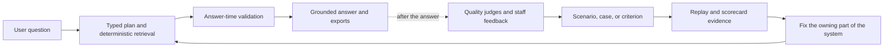
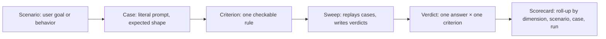

# 4. Quality & Evaluation

**How Compass knows whether an answer is grounded, accurate, and useful — and how a failure becomes a fix.**

> **A living reference, not a live dashboard.** This section describes the
> quality model itself. Where it states a scenario count or a result, the
> number is dated to the
> [2026-08-12 ledger export](reference/2026-08-12-evaluation-results.md) —
> the companion document holding every sweep ID, denominator, and method note
> behind the figures here. A future refresh replaces that dated file and
> updates this page together with it.

## The short version

Compass quality is not one score and it is not one kind of test. We use three
related layers:

1. **Answer-time safeguards** protect the answer being returned. The application
   retrieves typed data, builds a grounded result, checks the result, and falls
   back to a deterministic answer when an optional rewrite fails validation.
2. **Saved benchmark evaluations** test known questions repeatedly before and
   between releases. They tell us whether a change improved or regressed a
   particular kind of behavior.
3. **Post-launch monitoring and staff feedback** show us what real users are
   asking and which failures the benchmark does not yet cover.

The aim is twofold: Compass should not say something that is unsupported by the
reviewed NCTQ data, and it should follow the instructions for how that data must
be selected, labeled, cited, explained, and formatted. When those aims conflict
with convenience, grounded correctness wins.

The first path is a product safety path. The second path is an evaluation and
learning path. They inform each other, but a background evaluation verdict is
not a pre-send approval gate: the current quality judges record diagnostic
results after the response has shipped and do not edit or block it. See
[Product & Answer Flow](02-product-and-answer-flow.md) for the answer pipeline.

## 1. What we mean by quality

For a policy answer, “correct” has more than one meaning. A response can contain
real numbers and still be wrong because it used the wrong districts, ignored a
filter, mislabeled a gap in coverage, sorted the results incorrectly, or cited a
source that does not support the claim. It can also be factually sound but
misleading if its table, prose, and download disagree.

The durable quality model therefore evaluates seven accuracy dimensions:

| Dimension | The question it asks |
| --- | --- |
| **Selection** | Did Compass choose the right districts, metrics, peers, and years? |
| **Data fidelity** | Do the values, counts, denominators, and labels match the reviewed source data? |
| **Coverage-state labeling** | Did the answer distinguish covered data from “issue not addressed,” “not reviewed,” “not applicable,” or “out of universe”? |
| **Filtering** | Did it honor every constraint in the user’s question? |
| **Sorting** | Is the ordering correct, including ties and the requested direction? |
| **Citation** | Can each material claim and data cell be traced to a real supporting source? |
| **Consistency** | Do the lead, prose, table, citations, follow-up answer, and export agree? |

**Voice & tone** is a separate cross-cutting quality lens. It asks whether the
answer is plain-spoken, direct, appropriately qualified, and consistent with the
house style. It is not an eighth accuracy dimension: a voice change should not
silently change accuracy scores. The style standard is summarized in
[Product & Answer Flow](02-product-and-answer-flow.md#voice-and-tone).

These dimensions describe what a good answer must do. They do not by themselves
tell us whether a particular answer passed; that requires a saved question, an
explicit expected behavior, and a recorded evaluation.

## 2. The saved scenario library

The benchmark is a library of questions that we keep so the system can be tested
again after a code, data, instruction, or model change. A saved item is more than
a prompt copied into a spreadsheet. It should preserve the context needed to
reproduce the test and explain what success means.

The working vocabulary is:

- A **scenario** is a user goal or behavior family, written in plain language.
  It defines the situation we care about, such as a ranking question, a coverage
  question, a follow-up, or a request that Compass must refuse.
- A **case** is a runnable version of that scenario: the literal prompt, any
  required conversation context, the expected route or answer shape, and the
  source/data assumptions needed to replay it.
- A **criterion** is one checkable rule for a case. Criteria are deliberately
  narrow: for example, “the answer applies the requested year filter,” “the
  coverage caveat is present,” or “every displayed value has a supporting
  citation.” One case can have several criteria across several dimensions.
- A **verdict** is the recorded result for one answer and one criterion. It keeps
  the answer, criterion, time, evaluation path, and outcome together so a result
  can be audited rather than reduced to an unexplained percentage.
- A **sweep** is a named run that replays a set of cases and writes its verdicts
  to the evaluation ledger. Repeated runs are retained; they are evidence over
  time, not a replacement of history.
- A **scorecard** rolls those verdicts up so the team can see performance by
  dimension, scenario, case, and run. A roll-up is a useful signal, not a claim
  that every untested question is safe.

This chain — scenario, case, criterion, sweep, verdict, scorecard — is the
evaluation ledger's spine. Every dated figure in this document traces back to
it: a headline number names the sweep it came from, not just a percentage.

### An example, end to end

One real scenario from the library makes the vocabulary concrete.

**The scenario:** `REGR-ANSWERABILITY-LADDER-COMPOUND-SORT-RESUME` (dimension:
Sort Accuracy). A user asks for *"the 10 largest districts, ordered by
mascot."* Mascot is not a field Compass can rank by. The expected behavior is
written into the scenario: Compass must not dead-end with a canned "I need a
district group and a metric" rescue. It should answer the answerable part and
offer its real rankable fields (enrollment, free/reduced-price-lunch
percentage) as clickable options — and when the user clicks one, resume the
ranking deterministically rather than re-planning from scratch.

**The case** is the runnable version: the literal prompt above, the expected
route (a grounded clarification, then an execution), and the follow-up click.

**The criteria** are the individual checkable rules attached to it. Different
rules need different kinds of checker, and the library uses four:

| How it's checked | What that means | A real criterion of this type |
| --- | --- | --- |
| **Deterministic code** | A program inspects the typed answer artifact. Same input, same verdict, every time. | `respects_user_limit`: when the user says "top 10," the response contains exactly 10 data rows — not more, not fewer. |
| **AI judge** | A model reads the conversation against one written rule. Strong at semantics; needs calibration and human spot-checks. | `preserves_prior_context`: when the user asks to re-sort an established set, Compass re-sorts *that* set, not a fresh national ranking. |
| **Telemetry assertion** | Checks the system's own instrumentation — did the pieces actually run? | `execution_dispatched_for_execute_route`: the executor emitted a real execution span for the turn, so the answer came from a planned query rather than a shortcut. |
| **Holistic scenario fit** | One broad AI judgment: "did this response materially meet the case's expected behavior?" The strictest and noisiest lens — useful as a net, never the only measure. | `SCENARIO_FIT_001`, applied across the library. |

**The verdicts:** when a sweep replays this case — often three trials per
case, because the system is not perfectly deterministic — every criterion ×
trial pair writes one recorded verdict: pass, fail, or error, with the
judge's reasoning attached. Nothing is overwritten; a later sweep adds rows
rather than replacing them. That is why this document can quote results from
May and June side by side and say exactly which run each number came from.

The intended source of truth is the append-only evaluation ledger: scenarios,
cases, criteria, verdicts, and sweep runs. A spreadsheet or dashboard can be a
review surface, but it should not become a second, conflicting definition of
what a scenario means.

Good scenarios are kept when they expose a meaningful behavior, not simply
because they are easy to grade. They should include ordinary questions,
boundary cases, refusal/out-of-scope cases, follow-ups, and examples from real
staff or user feedback. When a failure is fixed, the literal prompt or a faithful
equivalent should remain in the library as a regression case. When the underlying
data, product contract, or expected behavior changes, the case should be
reviewed and versioned rather than silently rewritten to make a new result look
better.

As of the [2026-08-12 ledger export](reference/2026-08-12-evaluation-results.md#the-scenario-library-over-time),
390 of 391 scenarios are active — up from 326 at the June 9 internal audit,
the same library at two points on its growth curve. The number changes as
scenarios are added, retired, split, or deduplicated; it describes the
library's state at the export timestamp, not any particular release.

### Where the benchmark questions themselves live

The counts above describe the library's size; this is how to read its
*contents* — the actual test questions Compass is evaluated against.

The library is **data, not a document**. It lives in the evaluation ledger in
the `compass` schema (`scenarios`, `cases`, `criteria`), which is why this
documentation set does not carry a frozen list of prompts: a pasted list would
be a snapshot of one afternoon, and the library changes as cases are added and
retired. There are three ways to read the current set, in increasing order of
directness:

| Surface | What it gives you | Access |
| --- | --- | --- |
| Dashboard **Compass > Scenarios** | Browsable list of scenarios and their cases, with the literal prompt, expected behavior, and attached criteria | Admin-only, in the staff dashboard |
| `GET /api/v1/scenario-cases` and `GET /api/v1/scenario-cases/{case_id}` | The same content as JSON, for export or offline analysis | Admin-only API key ([§8](08-technical-reference.md#api-reference)) |
| The ledger tables directly | Everything, including retired cases and full verdict history | Read-only database access |

A per-dimension count of the active library at the export timestamp — how many
scenarios exist for Selection, Data Fidelity, Citation, Coverage-State
Labeling, Filtering, Sorting, Consistency, and Voice & Tone, plus the retired
dimensions — is in the
[dated evidence file](reference/2026-08-12-evaluation-results.md#the-scenario-library-over-time).
Section 2's [worked example](#an-example-end-to-end) above shows one real
scenario end to end, from its literal prompt through its four kinds of
criteria, as a template for reading any other entry.

Two honest caveats about the library as a deliverable. It has **no named owner
or review cadence**, which is tracked as an open item in
[§9](09-known-issues-and-limitations.md#the-scenario-library-has-no-named-owner-or-review-cadence);
a library that grew from 326 to 390 entries without a retirement policy will
contain some duplicate and stale cases. And it is finite: it covers the failure
modes the team has found so far, which is not the same as covering the
questions users will ask next.

## 3. How Compass runs evaluations

There are several ways to evaluate Compass. They answer different questions and
their results should not be mixed as if they were one benchmark.

| Evaluation method | What it tells us | What it does not prove |
| --- | --- | --- |
| **Answer-time validation** | Whether the current response conforms to known grounding, shape, citation, and data-integrity rules before it is rendered and delivered | That the response is good on every semantic or stylistic dimension |
| **Background quality judging** | Which criteria appear to pass or fail on real conversations after delivery | That a judge’s verdict is always correct, or that the answer was blocked before a user saw it |
| **Saved-case sweep** | Whether the current system reproduces expected behavior across a fixed set of cases | That unrepresented questions or new data conditions will behave the same way |
| **Targeted replay and judge calibration** | Whether a change came from the product or from the evaluator itself | A clean product comparison if the case, data, prompt, or judge changed at the same time |
| **Human review and staff feedback** | Whether the benchmark reflects real user needs and whether a grader missed context | A reproducible aggregate score unless the observation becomes a saved case and criterion |
| **Data-pipeline validation** | Whether the inputs and nightly data push meet source, schema, row-count, and integrity expectations | Whether the conversational answer used those inputs correctly |

### Answer-time validation

The product’s strongest protections are deterministic. Compass does not ask a
model to invent a number, district identifier, or citation. The typed plan is
executed against the approved data, and the writer assembles the result and its
citations from that validated artifact. A final check rejects added or changed
facts that are not in the sealed result; if an optional rewrite fails, the
validated deterministic answer is returned instead.

This protection is intentionally narrower than a complete reading-comprehension
test. The current final check is much better at catching an added or altered
number than at proving that every important nuance was retained in free prose.
The known limitation and the planned fact-coverage gate are documented in
[Known Issues & Limitations](09-known-issues-and-limitations.md#the-final-check-catches-added-facts-not-dropped-ones).

### Background evaluation

After a response, a classifier selects relevant criteria and quality judges write
pass/fail verdicts to the append-only ledger. This is useful for finding patterns
in live traffic and feeding the scorecard, but it is diagnostic under the current
design. It does not edit the answer and does not block the user’s response.

That distinction matters when interpreting a result: a failed background
criterion is evidence to investigate, while a passed criterion is not a formal
guarantee that the answer is perfect.

### Saved-case sweeps and targeted replay

The evaluation runner replays saved cases, often with more than one trial per
case, and records each outcome. A sweep can be broad, covering the benchmark, or
targeted to one dimension, issue, model, or release. The same ledger and scorecard
should receive the results so that a run can be compared with earlier runs.

For a meaningful before/after comparison, the team separates three effects:

1. old product code with the old evaluator;
2. old product code with the new evaluator; and
3. new product code with the new evaluator.

The second-minus-first result estimates evaluator/judge drift. The third-minus-
second result is the more useful estimate of the product change. This is one way
to avoid declaring victory because the judge became more lenient.

### Human review, feedback, and data checks

Human review is part of the loop, not a competitor to automated evaluation.
Reviewers help decide whether a criterion is fair, whether a failure is real, and
whether a user report deserves a permanent regression case. Staff can also flag
live conversations; those flags are leads for investigation until they are
reproduced and defined precisely.

The upstream Databricks pipeline has its own validation gate, audits, and reports
before data reaches production. Those checks protect the input universe — row
counts, nulls, uniqueness, schema shape, and the integrity of a nightly push. They
complement answer evaluation but cannot replace it. A clean data load does not
prove that Compass interpreted a question correctly. See [Data & the Databricks
Platform](03-data-and-databricks.md).

## 4. How the scorecard should be read

The scorecard is a roll-up of criterion verdicts, not a single model opinion. A
criterion is evaluated at the smallest useful unit, then results can be viewed
from trial to case, scenario, dimension, and run. A failing criterion should not
disappear because other criteria passed; the worst relevant result remains visible
for triage.

The configured launch targets have historically been dimension-specific rather
than one universal bar:

| Dimension | Configured target |
| --- | ---: |
| Selection | 95% |
| Data fidelity | 99% |
| Coverage-state labeling | 98% |
| Filtering | 95% |
| Sorting | 98% |
| Citation | 98% |
| Consistency | 95% |

These are configuration targets, reviewed on a dated basis; they are not a claim
about current performance. Any published result must pair with the exact sweep
date, code/model configuration, case set, criterion set, and denominator.
Without those, a percentage is too easy to misread.

### Dated results (2026-08-12 export)

Across 2026-05-17 through 2026-07-07, the evaluation ledger recorded 471,489
automated criterion verdicts over 413 sweep runs. The table below scores each
dimension's single most-comprehensive completed sweep as of the export, using
the scorecard's own math — full sweep IDs, denominators, and method in the
[dated evidence file](reference/2026-08-12-evaluation-results.md#per-dimension-results-pinned-sweeps).

| Dimension | Result | Target | Evaluable trials | Sweep finished |
| --- | ---: | ---: | ---: | --- |
| Sort | 99% | 98% | 919 | 2026-06-22 |
| Citation | 92% | 98% | 1,606 | 2026-06-15 |
| Consistency | 89% | 95% | 1,467 | 2026-05-26 |
| Filtering | 73% | 95% | 599 | 2026-06-22 |
| Coverage-state labeling | 68% | 98% | 823 | 2026-06-22 |
| Data fidelity | 62% | 99% | 1,236 | 2026-06-22 |
| Selection | 47% | 95% | 184 | 2026-06-22 |

No row blends runs with different build or grader fingerprints; the seven
sweeps span 2026-05-26 to 2026-06-22, and that span — not a single date — is
these results' "as of." Two dimensions clear their configured target; five do
not, Selection and Data Fidelity by the widest margin. That is the honest
current reading, not a rounded-up summary.

One number deserves its own caveat. The Selection row's 47% comes from a sweep
that ran only the holistic scenario-fit judge — the strictest single lens in
the library. A sibling sweep on the *same day, same 97 cases, same build*
using the structured checks read 65%, and a week earlier the broadest
Selection measurement in the ledger — all four checker types, three trials
per case, 4,954 evaluable trials — read 93%. None of those is "the" score;
each is one instrument's reading. Section 5 explains why the measurement
moved as much as the product did, and why the strictest reading is the one
published here.

The scorecard also needs qualitative judgment. A high aggregate can hide one
high-risk failure mode, a stale case set, or an evaluator that is grading the
wrong thing. Conversely, a lower score can reflect criteria that are too strict,
duplicated, or no longer match the product contract. Scorecard review therefore
asks both “what failed?” and “was this a fair, current test?”

## 5. What the evaluation work has taught us

The team has struggled to apply one consistent evaluation approach over time.
That history is important: it is why the definitions above matter more than a
single headline number.

### The hardest problem was measuring consistently

Across the ledger's 413 sweeps there are 122 distinct criterion-set
fingerprints and 111 distinct product builds. In plain terms: the grader and
the product were both changing, nearly continuously, at the same time. That
was a deliberate choice — the team was learning what Compass actually
produced and encoding each lesson as a new or stricter criterion — but it has
a real cost: almost no two sweeps are a controlled comparison, and a score
that moved between two dates may reflect the product, the criteria, or both.

Two dated trajectories show what that looks like
([full tables](reference/2026-08-12-evaluation-results.md#score-trajectories-and-measurement-consistency)).
Selection's comprehensive sweeps read 54% → 100% within hours on May 22 (a
grading-era fix, not a product transformation), 98% on June 9 under newly
structured checker types, 93% on June 15 when the strict holistic judge was
added to the mix, and then 65% and 47% on June 22 — the same 97 cases on the
same build, measured through two different lenses. Sort is the contrast:
after a May 28 trough at 49%, it converged to 99% and held there across four
June sweeps while its case set grew from 34 to 39. Where the instrument was
held steady, the improvement is visible and durable; where the instrument
kept changing, the trend line is honest only sweep by sweep.

Two things stayed true through the churn. First, the direction of the
instrument was one-way: criteria were added and tightened (32 created in May,
34 in June, 34 in July), never quietly loosened to make a number look better.
Second, where behavior was pinned with a fixed regression case, it stayed
fixed on that case: the worked example in section 6 passes its regression
criteria on every recorded verdict after its fix date, including in the
currently pinned sweep. (The same criteria do record failures when the
evaluation classifier applies them to *other* cases they were never scoped
to — a known instrument issue, tracked in
[§9](09-known-issues-and-limitations.md#evaluation-program).) The program got
better at finding problems faster than the product could make them disappear,
which is the right direction for the ledger to be wrong in.

### Recurring lessons

Several recurring lessons have emerged from dated audit and replay work:

- **A judge can be stricter than the product contract.** Some criteria treated a
  useful answer as a failure because they expected wording, precision, or a source
  that the case did not actually require. Criteria need calibration and human
  review.
- **Coverage language is a correctness issue.** “Not reviewed,” “issue not
  addressed,” and “out of universe” are not interchangeable. A response can use
  a real row and still mislead if it assigns the wrong state.
- **Fallbacks can rescue an answer without fixing the cause.** A deterministic
  fallback is valuable protection, but a passing final answer may still indicate
  a planner, execution, or renderer failure that should be investigated.
- **Evaluation sets can drift.** Duplicate, stale, or poorly scoped cases make
  trends difficult to interpret. The library needs ownership, dates, status, and
  a reason for changes.
- **Cross-surface consistency needs its own checks.** The table, lead sentence,
  citation block, follow-up, and export are different ways a user encounters the
  same result. Agreement across them is not guaranteed by checking one surface.

These are lessons from the evaluation process, not a current score or a claim
that every historical failure remains unresolved.

### Three failure-to-fix stories

The judgment calls behind these stories are the credibility, not the scores.
Dates and identifiers for each are in the
[dated evidence file](reference/2026-08-12-evaluation-results.md#how-the-evaluation-program-got-more-stringent-apriljune-2026).

**Story 1 — the criterion precision review found a recall gap, not a false
alarm.** On 2026-06-21, a review of every high-volume evaluation criterion
asked a narrow question: when a criterion fails, is the failure real? Across
the board, most were — the criteria were not the problem. But the same review
surfaced the opposite risk: of 10 cases where a refusal or canned rescue
actually happened, the holistic judge had passed 7 of them. The evaluator
wasn't crying wolf; it was missing wolves. That distinction — calibrate a few
over-strict criteria, but build a new check for the blind spot rather than
loosen anything — is why a deterministic
`answerability_rescue_fallback_is_failure` check exists today, and why the
dimension scores above can now see problems an earlier, more permissive
evaluator could not.

**Story 2 — the answerability-ladder campaign closed dead ends the stricter
evaluator had just made visible.** Between 2026-07-03 and 07-05, three waves
of work replaced dead-end refusals with grounded next steps: a non-rankable
sort now offers a clickable menu of fields that can be ranked instead of a
canned "can't do that"; a peer-salary comparison that used to bottom out in a
rescue now resolves to a real, answerable comparison; an unsupported request
gets a specific, honest "no" rather than a generic one. Each fix shipped with
its own regression criterion, evaluated at three replay trials per case
against the cases it was meant to fix.

**Story 3 — the footnote precedence fix, and the 22 flips it deliberately did
not make.** On 2026-07-06, an audit compared two ways to prefer a citation's
footnote over its source document. The simpler rule — any footnote with
enough letters and digits beats the document — would have changed 415 rows,
and 8 of those were wrong: a stray non-citational note would have displaced
5 to 11 real linked documents each. The shipped rule instead requires a
footnote to contain a legal-authority marker (a statute symbol, "case law," a
reporter citation, and similar) before it can outrank a document. That
version changed exactly 393 rows, all on the five bargaining and strike
metrics, and left 22 weaker footnotes as a last resort rather than promoting
them. The 22 that were not changed are as much the result as the 393 that
were.

## 6. From a failure to a fix

The intended closure loop is:

1. **Reproduce the problem** with the user’s literal prompt whenever possible.
2. **Classify the failure**: selection, data fidelity, coverage state, filter,
   sort, citation, consistency, voice, data pipeline, or evaluator quality.
3. **Save the behavior** as a scenario/case with one or more checkable criteria.
4. **Fix the owning boundary** — planner, catalog/execution, renderer, memory,
   instructions, data pipeline, or evaluation layer. A later rendering patch
   should not conceal an upstream selection or grounding defect.
5. **Replay the case** before and after the change, using the same data and
   evaluator where possible.
6. **Review the verdict** with a person when the criterion is subjective or the
   result is surprising.
7. **Keep the evidence**: the case, criterion, run, verdict, and decision about
   whether the issue is fixed, accepted, or still open.

An aggregate score alone does not close a bug. Closure needs a regression case and
evidence that the relevant dimension improved without breaking another one.

### A worked example

Scenario `REGR-M1-SCHOOL-DAYS-DC-ANCHOR` (a Filter Accuracy case about a
school-days anchor comparison) has one case. On 2026-06-16, that case's
`answerability_rescue_fallback_is_failure` criterion — the check built for
the recall gap in Story 1 above — recorded a failing verdict: the case had
fallen into a canned rescue instead of a grounded answer. Four days later, on
2026-06-20, a second, case-specific regression criterion was added to the
ledger to pin the corrected behavior going forward. Both criteria have passed
on every recorded verdict for this case since — including in the sweep now
pinned as Filtering's headline result above, finished 2026-06-22. That same
sweep also shows this case failing an observability check (a missing trace
ID) — left visible rather than smoothed over, because a fixed case is not the
same claim as a fully instrumented one. Every identifier in this chain is in
the [evidence bundle](reference/2026-08-12-evaluation-results.md#worked-example-evidence-bundle).

## 7. What this system does and does not prove

The quality system can provide strong evidence that:

- displayed facts and citations came from the approved, closed data system;
- known constraints such as selection, filters, ordering, and coverage labeling
  are being tested explicitly;
- a change was replayed against saved behavior rather than judged from one
  appealing example; and
- staff feedback can become durable tests instead of disappearing into a ticket
  or conversation.

It cannot prove that Compass will answer every future question correctly. The
benchmark is finite, the data changes, human criteria require calibration, and
the current final check does not yet fully prove that every required prose fact
was retained. The honest claim is therefore not “the agent is always right.” It
is: the system has defined failure modes, tests them with saved evidence, protects
known grounding boundaries at answer time, and turns newly discovered failures
into tests and fixes.

## Where the open issues live

The evaluation program's known issues and open questions — run-to-run
comparability, criteria over-application, the below-target dimensions, judge
recall limits, library governance, and the rest — are tracked with the other
product limitations in
[§9 Known Issues & Limitations](09-known-issues-and-limitations.md#evaluation-program),
each with its evidence and next step. Two former open questions are settled
by the dated export and no longer tracked: the active scenario inventory
(section 2 above) and which dated runs are published as the most recent
results (section 4 above).
