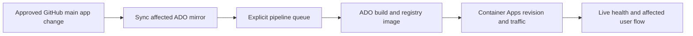

# 6. Hosting, Deployment, and Security

Compass runs as three applications on Azure production. This is the single
current release and recovery runbook. Local development uses approved runtime
configuration; the older Coolify staging model is historical/unverified, not a
confirmed release prerequisite. No cloud configuration changed in this docs update.

## 6.1 Authority and scope

- **Authoritative application source:** this GitHub repository, its settings,
  manifests, and [sync workflow](../.github/workflows/sync-to-azure-devops.yml).
  The mapping below was reviewed at
  `13788f5bb3fdf68db7ffd82b2036042fadc709bf`.
- **Current operational authority:** this runbook; [AGENTS.md](../AGENTS.md)
  covers engineering commands and approval boundaries, not a second release recipe.
- **Projection/derived:** application files copied into Azure DevOps repositories.
  Make feature changes in GitHub, not directly in those mirrored files.
- **Separate deployment authority:** protected ADO pipeline/infra scaffolding and
  Azure runtime configuration. Inspect their current versions with authenticated
  access before changes; they are not all present in this checkout.
- **Historical:** [PROVENANCE.md](../PROVENANCE.md), earlier handoff inventory,
  and pre-consolidation branch/mirror instructions. They do not establish current
  live state or prove that older repositories have been retired.

[Administration and Dashboard](05-administration-and-dashboard.md) covers staff
access; [Costs, Accounts, and Budget](07-costs-accounts-and-budget.md) covers
account ownership. Keep credentials and private diagnostics out of release records.

## 6.2 Applications and environments

| Application | Source | Local/container port | Production runtime |
| --- | --- | --- | --- |
| Policy Advisor API | `backend/src/compass_backend/` | `8000` | Azure Container Apps |
| Compass Frontend | `frontend/` | Local `3000`; container `80` | Azure Container Apps |
| NCTQ Dashboard | `dashboard/src/nctqai/` | `5001` | Azure Container Apps |

Local setup and image builds are in [AGENTS.md](../AGENTS.md). Runtime startup
needs approved database, model, and authentication configuration. Do not use
production writes as a local test strategy.

**Historical/unverified staging:** earlier guidance described manual Coolify
builds of a `staging` branch on a private-tailnet host and a separate PostgreSQL
database. This review did not verify that branch, app identifiers, network access,
migration lane, or scheduled tasks. Do not execute those older instructions as a
current procedure. If staging is needed, have its owner confirm the target,
source SHA, credentials, database posture, and authorized deploy/verification path.
Staging and Azure production are distinct lanes; one does not prove the other.

## 6.3 Production source and pipeline mapping

The workflow pushes affected application contents to `main` in the following
ADO project/repository pairs in organization `https://dev.azure.com/nctqai`:

| GitHub path filter | ADO project/repository | Pipeline ID | Protected ADO scaffolding |
| --- | --- | --- | --- |
| `backend/**` | `compass-api` | `2` | `azure-pipelines.yml`, `Dockerfile.api` |
| `frontend/**` | `compass-fe` | `1` | `azure-pipelines.yml`, `infra/` |
| `dashboard/**` | `compass-dashboard` | `3` | `azure-pipelines.yml` |

A push to GitHub `main` triggers this workflow only for those paths. Tests and
Markdown inside those folders count. Root files and `docs/**` do not. A
workflow-only change does not trigger or exercise this path. PR/feature-branch
pushes do not deploy through this workflow. There is no manual-dispatch trigger.

Sync removes tracked application files except the protected names, copies the
GitHub folder contents, commits an effective diff, checks protected paths still
exist, and pushes ADO `main`. Do not add colliding scaffold filenames to an app
folder: copying could overwrite them; the guard checks presence, not integrity.
When there is no effective diff, push and queue are skipped.

The executable queue step explicitly POSTs to the ADO Build API for the mapped
pipeline and `refs/heads/main`; it does not rely on the unreliable CI auto-trigger.
The workflow header's older auto-trigger/rename comments are not the contract.
`AZURE_DEVOPS_PAT` needs code read/write and build execution access. Never print it.
The queue response is discarded by the workflow, so a green queue step does not
supply an independently verified build ID or result.

Earlier inventory lists Central US, subscription Microsoft Azure Sponsorship,
and resource groups `NCTQ_AI_PA_API`, `NCTQ_AI_PA_FE`, `NCTQ_AI_Piper`, `NCTQ_PA`
(database), and `NCTQ_AI_Data` (data/email services). Treat these as **handoff
inventory to reconfirm**, not live-discovered targets. Confirm app, subscription,
registry, resource group, revision mode, and traffic before any operator action.
No claim is made here that older GitHub mirrors or deploy branches are retired.

## 6.4 Production release and failure triage



Plain-text equivalent: approved GitHub `main` app change → ADO mirror sync →
explicit queue → build/image → revision/traffic → live verification.
Only sync and queue run in the GitHub workflow; inspect downstream evidence
separately. A source SHA, mirror commit, build ID, image digest/tag, and revision
are different identifiers, not interchangeable proof.

### Before merge

1. Identify the exact reviewed SHA, affected application paths, release owner,
   expected behavior, dependencies, and known-good revision.
2. Run focused tests and browser checks for affected boundaries. Answer/planner
   changes need approved scenario and scorecard evidence. Resolve missing tooling
   rather than invoking inherited scripts absent from this curated checkout.
3. Review any schema/configuration dependencies with the platform owner. This
   runbook does not authorize migrations or production SQL writes.
4. Obtain **explicit user approval to merge to `main`**. Approval to create a PR
   is not merge approval. If several app folders change, their lanes can run in
   parallel; coordinate the change before merging rather than assuming serial deploys.

### Verify each gate and stop at the first failure

| Gate | Evidence to record | Failure triage |
| --- | --- | --- |
| Trigger/detect | Merge SHA, workflow run URL, affected folder outputs | Check branch and path filters first. Docs-only or workflow-only absence is expected; do not manufacture an app change to force a release. |
| Mirror sync/push | App lane, ADO commit, scaffold guard, effective diff | Inspect clone/auth, sync diff, protected paths, and push conflict. Do not force-push, delete scaffolding, or retire a mirror to bypass failure. |
| Queue accepted | Successful explicit queue step for the mapped pipeline | Check build-execute permission and API error. Sync success alone is insufficient. Inspect existing ADO runs before any separately authorized retry to avoid duplicate builds. |
| Build/image | Authenticated ADO build ID, source commit, result, image identifier | Read the failing pipeline stage and its actual Dockerfile/context. Do not change registry, NAT, identity, or secrets speculatively. |
| Revision/traffic | Expected image, healthy revision, startup logs, assigned traffic | Inspect configuration, dependency/schema errors, and revision mode. A green image build or an older healthy revision is not acceptance. |
| Live behavior | Health/readiness plus actual affected flow at the intended URL | Check served assets, browser errors, API proxy/SSE, and dependencies. HTTP 200 or DOM presence alone does not prove interaction or media playback. |

The normal workflow already queues the build; do not add a routine manual queue.
After authenticated Azure access and exact target discovery, these are read-only
inspection command shapes (replace placeholders; do not paste credentials):

```bash
az containerapp revision list --name <app> --resource-group <resource-group> --output table
az containerapp logs show --name <app> --resource-group <resource-group> --revision <revision> --tail 40
```

Record every gate, including unavailable evidence, operator and time. Keep the
known-good revision while observing the rollout. If access is unavailable, state
which gate is unverified and request the operator's evidence; do not report a
fully verified Azure deployment from GitHub success alone.

### Latest recorded frontend proof — 2026-09-09

[PR #75 verification](https://github.com/Starling-Strategy/compass/pull/75#issuecomment-5605332401)
records merge SHA `13788f5bb3fdf68db7ffd82b2036042fadc709bf` and successful
[GitHub run 34376572257](https://github.com/Starling-Strategy/compass/actions/runs/34376572257).
Only frontend synced/pushed and queued `compass-fe` pipeline `1`; backend and
Dashboard sync/push/queue steps were skipped. The recorded frontend mirror
transition was `a5dacde` → `f80a148`.

At [production Compass](https://compass.nctq.ai), that verification observed the
welcome video link, actual progressing video playback, close/Escape cleanup,
focus restoration, keyboard activation, and desktop/mobile layouts without
horizontal overflow. Client approval was reported by Macon. This is dated
release evidence, not a new live check performed by this documentation update.

**Evidence limit:** the Azure DevOps CLI had no authenticated credentials in the
verification environment. Downstream Azure build ID/result and deployed revision
were not independently inspected. Confirmed GitHub sync/queue plus actual live
frontend behavior is not independent Azure control-plane verification, not
API/Dashboard end-to-end testing, and not proof that old mirrors were retired.

## 6.5 Runtime configuration and secrets

Supply environment-specific configuration at runtime. Do not bake credentials
into images, repository files, JavaScript, page source, build output, or release
notes. Store sensitive production values as Azure Container Apps secrets and
reference them from environment variables. Limit secret read and write access to
the smallest operator and service set that needs it.

The API reads PostgreSQL configuration from `PG_HOST`, `PG_PORT`,
`PG_DATABASE`, `PG_USER`, `PG_PASSWORD`, and `PG_SCHEMA`. The canonical schema
is `compass`. Its model traffic uses `PYDANTIC_AI_GATEWAY_API_KEY`; do not add
direct provider keys that bypass the shared gateway. Logfire uses separate
telemetry credentials. Secret settings are typed as secrets in application code
and must be unwrapped only at the client boundary.

The Frontend keeps `FASTAPI_API_TOKEN` and its API endpoint server-side. PHP
proxy routes add the token to backend requests. Browser code must never receive
it.

The Dashboard has its own database, session, SMTP or email, analytics, and
Logfire settings. Keep login delivery credentials, analytics service-account
material, cookie signing material, and database passwords in the runtime secret
store. Compass observability routes read `compass.*`; the
[Metric Calculator](reference/metric-calculator.md) is a separate workflow that
can write validated metric data.

Treat a configuration or secret change as a release. Record the change, create
or restart the intended revision using the approved Azure method, and repeat
startup, health, and smoke verification. Never print current secret values while
comparing configuration.

## 6.6 Security boundaries

| Boundary | Control | Operator rule |
| --- | --- | --- |
| Public browser to Frontend | HTTPS with an Azure managed TLS certificate | Keep HTTPS active, renew and bind certificates through Azure, and do not expose backend credentials to the browser |
| Frontend to API | Server-side bearer token over HTTPS | Store the token only in Frontend runtime secrets and rotate it with coordinated verification |
| Direct API access | `Authorization: Bearer pa_<env>_<token>`; SHA-256 hash lookup in `compass.api_keys` | Prefixes identify environment but are not the security control. Soft-revoke keys with `revoked_at`; never hard-delete audit records |
| API administration | Key owner resolves through `compass.api_keys.owner_email` to `compass.users.is_admin` on every request | Role changes take effect on the next request. Keep production auth enabled |
| Dashboard user access | Email one-time code, session cookie, and central role map with `viewer`, `analyst`, `power_user`, and `admin` | Manage access through the central user and role model. Do not add route-specific bypasses or a second role list |
| Application to PostgreSQL | Runtime database credential and schema setting | Use separate environment credentials, least privilege, encrypted transport where configured, and `compass` as the canonical schema |
| Operator or agent to staging PostgreSQL | Read-only MCP or an explicitly approved migration procedure | Treat any non-`SELECT` through the staging read surface as a guardrail violation |
| Operator or agent to production PostgreSQL | Read-only inspection only | Never make the session writable and never execute a mutating statement |
| Data platform to database | Scheduled, controlled load path | Use the documented sync and migration procedures. Do not improvise production writes |
| Model and telemetry services | Pydantic AI Gateway and Logfire credentials held by the API | Route models through the gateway. Keep telemetry tokens separate from model credentials |
| Cloud control plane | Azure role-based access, short-lived login, and application-specific pipeline service connections | Use least privilege, avoid shared long-lived credentials, and preserve an auditable release trail |

The production-write guardrail applies to human and agent operational access.
It does not mean the runtime applications are stateless: the API persists
conversations and verdicts, and the Metric Calculator has a controlled write
workflow. Those writes must occur through application code and scoped runtime
identities, not ad hoc operator SQL.

The historical platform overview says all three applications read and write the
shared database. Current repository guidance is narrower: the Dashboard's
Compass observability surface reads `compass.*`, while its Metric Calculator
writes validated metric data. Confirm the deployed database roles and grants,
then update the infrastructure inventory if they do not match this boundary.

## 6.7 Logging and observability

The handoff inventory places container and platform logs for all three lanes in
Azure Log Analytics; confirm the current diagnostic settings. Use those logs for revision startup, crashes, ingress,
resource pressure, and platform events. The API and Dashboard also use Pydantic
Logfire for application traces when configured.

A fresh backend chat turn should have one `compass.turn` root span covering
session load through persistence. When investigating a report, bind together
the session, assistant message, turn snapshot, SSE completion payload, trace ID,
and Logfire trace. Do not diagnose only from the rendered response. Telemetry
failure must remain observable, but non-blocking telemetry should not prevent an
otherwise healthy chat response.

Post-response quality evaluation writes live and sweep verdicts to
`compass.verdicts`. The Quality Scorecard reads this ledger. Earlier guidance
placed nightly sweeps in a staging Coolify scheduled task; that schedule was not
verified in this review and is not a production release step. Keep live user-turn
verdicts separate from sweep retention and never prune them by a
blanket creation-date rule.

Logs and traces can contain operational context. Apply the organization's
retention and access controls, avoid adding secrets or full credentials to log
attributes, and restrict exported diagnostics to the incident team.

## 6.8 Health checks and release evidence

Use these checks as signals with different meanings:

| Application | Check | What it proves |
| --- | --- | --- |
| Policy Advisor API | `GET /api/v1/health` | Process liveness and reported database status. The route is public and returns liveness while the process is serving |
| Policy Advisor API | `GET /api/v1/ready` | Readiness for traffic, including dependency state used by the application |
| Compass Frontend | HTTPS request to `/` | PHP and web ingress respond. Follow with a proxied chat or affected-flow smoke test |
| NCTQ Dashboard | `GET /health` | Dashboard process responds. Follow with authenticated access to the affected staff surface |
| Azure Container App | Revision state, traffic assignment, startup logs, and image identifier | The intended revision, not merely an older healthy revision, is serving |

A release is complete only when the pipeline succeeded, the expected image is
present, the intended revision is running and receiving traffic, startup logs
are clean, the health endpoint passes, and the affected user flow works. Health
alone can pass while an older revision still serves traffic.

## 6.9 Rollback procedure

Azure Container Apps revisions are the primary application rollback unit.
Rollback restores service first, then preserves evidence for diagnosis.

1. Declare the release unhealthy and pause further releases for the affected
   application.
2. Record the failing revision, image tag, build, Git SHA, configuration change,
   first observed symptom, and current traffic assignment.
3. Check whether the incident is application code, runtime configuration,
   database schema, data, network, model gateway, or another dependency.
4. With explicit incident-owner authorization, and after confirming revision mode
   and that the previous revision is compatible with the current schema and data,
   reactivate it and move all traffic back to that known-good revision.
5. Verify revision state, startup logs, the application health endpoint, and the
   affected user flow.
6. Preserve the failed revision and logs until evidence is captured. Do not
   delete it during the initial response.
7. If traffic rollback is unavailable, deploy the exact last-known-good image as
   a new revision and repeat verification.
8. Record recovery time, customer impact, and the final serving revision. Open
   follow-up work for the root cause and any missing alert or runbook step.

Representative traffic command shape, after the exact revision names have been
verified:

```bash
az containerapp ingress traffic set \
  --name <app> \
  --resource-group <resource-group> \
  --revision-weight <known-good-revision>=100 <bad-revision>=0
```

Do not attempt to undo an append-only database migration as an automatic part
of application rollback. First determine whether the prior application revision
is forward-compatible with the migrated schema. If a database correction is
required, use an approved forward migration with an explicit backup, review,
and production change plan.

## 6.10 Incident response

1. **Triage.** Identify the affected environment and application. Check ingress,
   revision state, health, recent releases, Log Analytics, Logfire, database
   reachability, and gateway or provider status.
2. **Contain.** Stop the release lane. Roll traffic back when a recent revision
   is implicated. Revoke or rotate a credential when exposure is suspected.
3. **Protect data.** Keep production operator sessions read-only. Do not repair
   data with ad hoc SQL. Preserve logs, traces, revision metadata, and audit
   records without copying personal data into tickets.
4. **Communicate.** Name the affected surface, user impact, start time, current
   mitigation, and next update owner. Do not publish credentials, private
   network details, or unverified root-cause claims.
5. **Recover and verify.** Restore the known-good revision or dependency, then
   run the full health and user-flow checks for that application.
6. **Learn.** Write a timeline and root cause, add a regression case when the
   failure was user-visible, strengthen monitoring or the runbook, and link the
   corrective work to the appropriate issue and review process.

Escalate immediately when an incident may involve credential exposure,
unauthorized access, loss or corruption of production data, TLS failure, or
material unavailability. Credential rotation, database changes, and public
communications require the designated platform owner.
