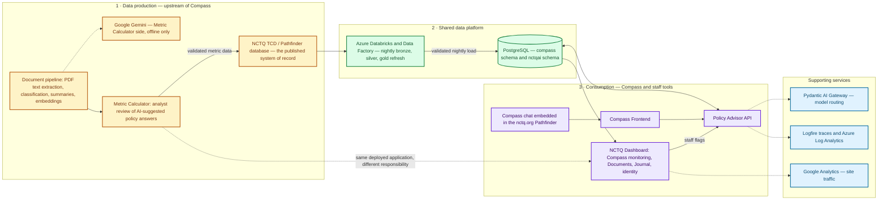
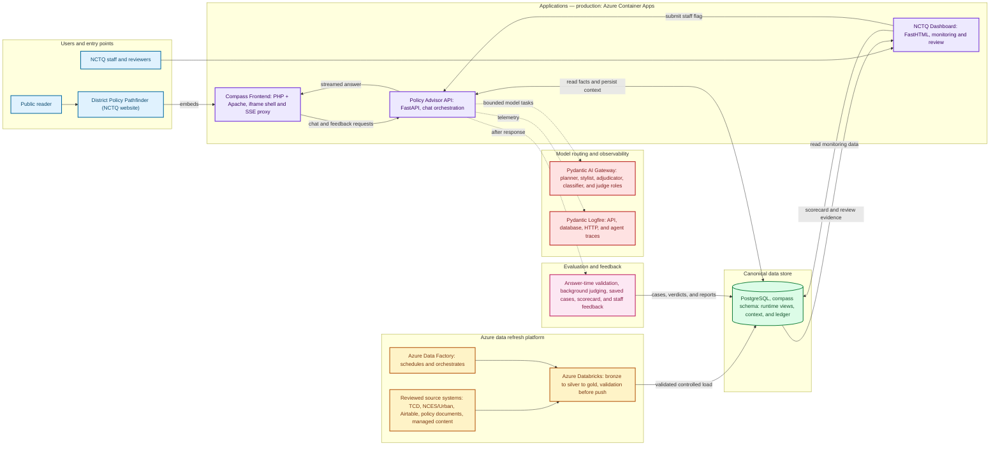

# Compass and NCTQ.ai system architecture

This page has two maps, at two altitudes.

The [**NCTQ.ai platform map**](#the-nctqai-platform-one-level-up) is the wider
view: every system running under NCTQ.ai, including the ones Compass does not
use, and which of them produce reviewed policy data versus consume it.

The [**Compass system map**](#the-full-system-map) is the detailed view: how the
Pathfinder entry point, the three applications, the request runtime, the
`compass` PostgreSQL schema, the nightly data platform, model routing,
observability, and evaluation fit together.

Read the platform map first if you are orienting; read the Compass map if you
are tracing a request.

Both are intentionally **sanitized system views**, not network diagrams or a
secret inventory. Production hosting and environment details belong in
[§6 Hosting, Deployment, and Security](../06-hosting-deployment-security.md).
The smaller, purpose-specific diagrams in §§2-4 cover individual stages; these
cover how the pieces connect.

## The NCTQ.ai platform, one level up

Compass is one product inside a larger platform, and the platform has pieces
Compass does not use. This first map is the wider view: everything running under
NCTQ.ai and how Compass sits inside it. The [Compass system map](#the-full-system-map)
below then zooms into the boxed region.

The distinction that matters most here is **which systems produce reviewed
policy data and which consume it**. Compass is strictly a consumer. The Metric
Calculator and the document pipeline are producers, upstream of Compass and not
part of its answer path — they help turn district documents into reviewed data,
which reaches Compass only after it has been published to NCTQ's TCD/Pathfinder
database and pulled through the nightly sync.

Read it left to right in three stages: reviewed data is **produced** (1), carried
through the **shared platform** (2), and **consumed** by Compass and the staff
tools (3).

Reading it as three deployed applications and their neighbors:

| Platform piece | Deployed as | Relationship to Compass |
| --- | --- | --- |
| Compass Frontend | Its own Container App | Part of Compass |
| Policy Advisor API | Its own Container App | Part of Compass — the engine |
| NCTQ Dashboard | One Container App serving several sections | The Compass monitoring sections are part of Compass's operating story; Metric Calculator, Documents, and Journal are adjacent staff tools in the same application |
| Document pipeline | Batch process in the dashboard codebase | Upstream producer, on the Metric Calculator side. Uses Google Gemini for enrichment and embeddings — the platform's only non-Anthropic model dependency, entirely offline, and not a Compass service |
| Metric Calculator | Dashboard section under `/mc/*` | Upstream producer, **not part of Compass**. See the [Metric Calculator reference](metric-calculator.md) |
| TCD / Pathfinder database | NCTQ system of record | The boundary between production and consumption: Compass reads only what has been published here |
| Databricks and Data Factory | Azure, in `NCTQ_AI_Data` | Shared; carries reviewed data into the `compass` schema nightly |
| PostgreSQL | Azure VM, in `NCTQ_PA` | Shared; holds both the `compass` and `nctqai` schemas, which are separate data domains |
| Pydantic AI Gateway, Logfire, Google Analytics | External services | Shared; see the [ownership inventory](../07-costs-accounts-and-budget.md#ownership-and-payer-inventory) |

Two boundaries in that table are easy to lose and worth stating outright. The
dashboard is **one application with several sections**, not several
applications — so "the Metric Calculator is not part of Compass" is a statement
about responsibility, not about deployment. And the single PostgreSQL instance
holds **two separate schemas**: `compass` for policy and conversation data,
`nctqai` for staff identity. Sharing a database server does not make those one
data domain, and the dashboard's own login accounts are not Compass API users.

## The full system map

This is Compass itself, in detail — the boxed region of the platform map above.
Read the solid arrows as the main request or data path. Dashed arrows show an
optional model call, asynchronous evaluation, or telemetry; they do not supply
the answer's facts directly. The colors are a visual aid only; the labels and
the text below carry the meaning.

### Text equivalent

1. A public reader reaches the chat through the NCTQ District Policy Pathfinder.
   The Pathfinder hosts the Compass Frontend in an iframe. NCTQ staff use the
   separate Dashboard.
2. The PHP/Apache frontend sends chat and feedback requests to the FastAPI
   Policy Advisor API and receives a streamed or non-streamed response.
3. The API loads conversation context, asks bounded model roles to interpret
   language where needed, resolves phrases against the approved catalog, runs
   deterministic queries, and assembles facts, citations, and exports. Optional
   wording polish happens only after the factual artifact is sealed.
4. The runtime reads the four stable answer views in the `compass` schema and
   stores conversation context and feedback in the same canonical PostgreSQL
   schema. The Dashboard reads those records for monitoring; staff flags are
   sent back through the API so the backend validates and persists them.
5. Azure Data Factory schedules the Azure Databricks refresh. Databricks moves
   reviewed inputs through bronze, silver, and gold stages. A validation gate
   must pass before the controlled load refreshes PostgreSQL; a failed run
   stops and alerts rather than publishing a partial dataset.
6. The Pydantic AI Gateway is the model-routing boundary. The model roles are
   separate from the data authority: the planner interprets the request, the
   stylist may improve wording, and the adjudicator/classifier/judges make
   bounded choices. None of them is the source of a district value or citation.
7. Logfire receives telemetry from the API, database, HTTP, and agent paths.
   After a response, background evaluation and saved-case sweeps write evidence
   to the evaluation ledger. Staff review and flags can become regression cases;
   fixes are replayed against the relevant boundary.

## Component map

| Component | Responsibility in the system | Detailed reference |
| --- | --- | --- |
| District Policy Pathfinder | NCTQ website entry point that hosts the public chat iframe and participates in the visitor-ID/prompt messaging contract | [Pathfinder integration in §8](../08-technical-reference.md#pathfinder-integration) |
| Compass Frontend | PHP/Apache chat shell, embed mode, browser rendering, and server-side SSE/API proxy | [Application layout in §8](../08-technical-reference.md#application-layout-and-runtime-shape) |
| Policy Advisor API | FastAPI boundary for authentication, session load, planning, catalog resolution, deterministic execution, rendering, persistence, and streaming | [Product & Answer Flow](../02-product-and-answer-flow.md) |
| NCTQ Dashboard | Staff-only monitoring, conversation review, data-universe views, quality views, and flag submission | [Administration and Dashboard](../05-administration-and-dashboard.md) |
| PostgreSQL and `compass` schema | Canonical store for answer data, runtime views, conversation records, feedback, reports, and evaluation evidence | [Compass schema reference](compass-schema.md) |
| Runtime read views | Stable read interface used by chat execution: `district_profiles`, `policy_questions`, `policy_answers`, and `answer_sources` | [Runtime materialized views](compass-schema.md#runtime-materialized-views) |
| Conversation context tables | `chat_sessions` and `chat_messages`, including the persisted turn snapshot carried in assistant-message JSON; feedback and reports provide review context | [Dashboard data boundaries](../05-administration-and-dashboard.md#data-boundaries) |
| Azure Data Factory and Databricks | Schedules and runs the reviewed-source refresh through bronze, silver, gold, validation, and controlled production load stages | [The nightly pipeline](../03-data-and-databricks.md#the-nightly-pipeline) |
| Pydantic AI Gateway and model roles | Routes bounded planning, writing, adjudication, classification, and judging tasks to the configured models | [How Compass uses different AI models](../02-product-and-answer-flow.md#how-compass-uses-different-ai-models) |
| Pydantic Logfire | Captures traces and spans used to diagnose a turn across API, database, HTTP, and agent boundaries | [Logging and observability](../06-hosting-deployment-security.md#67-logging-and-observability) |
| Evaluation and feedback loop | Combines answer-time validation, post-response judging, saved-case sweeps, scorecards, and staff flags; current judging is diagnostic, not a pre-send gate | [Quality & Evaluation](../04-quality-and-evaluation.md) |

Default model assignments are deliberately not copied into this map: model
selection is configuration that changes independently of the system boundaries
shown here. The current assignments live in the [prompt and model
inventory](prompt-and-model-inventory.md).

## Data and trust boundaries

The architecture has several deliberately different authorities:

- **Source data authority:** the reviewed source systems and the controlled
  Databricks pipeline determine what enters PostgreSQL. Applications do not
  hand-edit policy data during a chat turn.
- **Answer-data authority:** the runtime views and deterministic execution code
  determine which identifiers, values, coverage states, and citations can be
  used in a response. The model cannot mint those facts.
- **Language authority:** model roles can interpret bounded language or improve
  phrasing inside the contracts described in [§2](../02-product-and-answer-flow.md).
  A stylist failure falls back to the deterministic validated answer.
- **Operational review authority:** the Dashboard is a review surface. It reads
  canonical records and delegates controlled report writes to the API; it is not
  a second policy-data store.
- **Dashboard identity boundary:** Dashboard users, one-time codes, and browser
  sessions live in separate `nctqai.*` records. The Dashboard's Compass pages
  read `compass.*` monitoring and evaluation records, but those two data domains
  should not be treated as one authentication or session store.
- **Evidence authority:** the evaluation ledger records cases, criteria, verdicts,
  and sweep history. A Dashboard scorecard is a view of that evidence, not a
  replacement for it.
- **Observability boundary:** Logfire helps explain what happened in a turn. A
  trace is diagnostic evidence, not a source of policy truth and not a substitute
  for the persisted turn snapshot.

## Runtime objects at a glance

The full field-level data dictionary is the [Compass schema reference](compass-schema.md).
These groups are the ones that matter when following the architecture:

| Object group | Examples | Why it exists |
| --- | --- | --- |
| Runtime read views | `district_profiles`, `policy_questions`, `policy_answers`, `answer_sources` | Denormalized, governed read shapes for chat execution |
| Conversation context tables | `chat_sessions`, `chat_messages`, `fresh_compass_turn_snapshot` in message JSON | Reconstructs earlier turns and preserves what the user saw |
| User feedback and reports | `message_feedback`, `case_reports` | Captures reactions and staff review leads without editing the answer data |
| Evaluation ledger | `scenarios`, `cases`, `criteria`, `verdicts`, `sweep_runs` | Makes quality claims reproducible and auditable over time |
| Source and governed content | `navigator_*`, NCES enrichment, NCTQ publications/guidance, catalog and allowlist tables | Stores the approved universe and the rules that make it answerable |

## Evaluation and feedback loop

The loop has three related but separate paths:

1. **Answer-time protection** runs before delivery. Typed contracts, catalog
   checks, deterministic queries, citation assembly, and final validation protect
   the response being returned.
2. **Post-response evaluation** runs after delivery. A criterion classifier and
   quality judges write diagnostic verdicts; they do not edit or block the answer.
   Saved-case sweeps replay known behavior against explicit criteria and feed the
   same ledger and scorecard.
3. **Human feedback** starts in the Dashboard or a reviewer workflow. A flag is
   an investigation lead, not automatically a confirmed defect. The team
   reproduces it, classifies the owning boundary, saves a regression case when
   appropriate, fixes the cause, and replays the case.

This distinction prevents a clean data-pipeline run, a passing judge, or a useful
Dashboard chart from being mistaken for proof that every future question will be
answered correctly. [§4 Quality & Evaluation](../04-quality-and-evaluation.md) has
the evidence model.

## Deployment scope

The diagram is intentionally logical. Production application hosting runs on Azure
Container Apps against a shared production PostgreSQL environment, with a separate
Coolify-based staging path. The release, security, backup, and incident procedures
live in [§6 Hosting, Deployment, and
Security](../06-hosting-deployment-security.md) rather than here.
