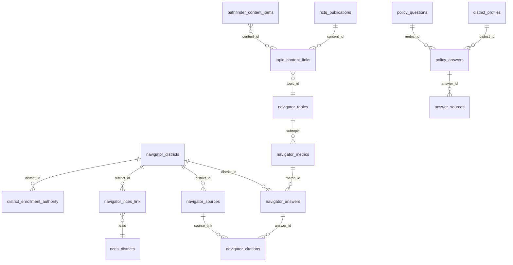

# Compass schema reference

This is the field-level reference for the data layer that Compass reads. It is
intended for people who need to understand what information exists, how the
objects relate to one another, and which objects form the chat application's
stable data interface.

It is deliberately more detailed than the narrative data-platform document. For
the plain-language explanation of where the data comes from and how it is refreshed,
see [Data & the Databricks Platform](../03-data-and-databricks.md).

## Scope and authority

This reference covers the canonical data objects defined by the Compass schema
and view definitions:

- 17 base tables in `compass_schema.sql`.
- 4 runtime materialized views in `compass_views.sql`.
- Keys, important relationships, and the fields exposed to the chat path.

The definitions are maintained in the source repository's
`src/compass_data_sync/compass_schema.sql` and
`src/compass_data_sync/compass_views.sql`. Those SQL files are the authority for
names, types, defaults, and constraints; this document is the human-readable
reference derived from them. The public Compass repository does not copy the
private data-sync deployment files or migration history into this document.

This reference does not list credentials, database hosts, live row counts, or
historical compatibility objects. The `policy_advisor.*` compatibility views are
legacy bridges, not the canonical schema. Authentication, conversation, and
evaluation ledgers are application-operational records managed by append-only
migrations; they are described in the relevant product and technical documents,
not mixed into this data dictionary.

## Relationship overview

The central answer path is the first row of the diagram: district and metric
catalogs identify an answer, citations connect that answer to source documents,
and the runtime views present the joined shape that the chat code reads.

The diagram is a conceptual relationship map, not a complete foreign-key graph.
Some relationships are enforced by database keys; others are governed joins on
identifiers or URLs. In particular, `topic_content_links.content_id` is a typed
reference whose target depends on `content_type`, and the citation-to-source join
uses `citation_link = source_link`.

## Runtime materialized views

These are the clean, denormalized interfaces used by the chat execution layer.
The underlying `navigator_*` and enrichment tables are storage and sync shapes;
the views are the main read shapes for answering questions.

### `compass.district_profiles`

One row per covered district, combining the most recent TCD district record with
NCES context and any governed enrollment-authority override.

| Field | Type | Meaning |
| --- | --- | --- |
| `district_id` | integer | NCTQ/TCD district identifier; unique view key. |
| `district_name` | text | District name used in answers. |
| `state` | text | State abbreviation. |
| `state_name` | text | Full state name. |
| `city` | text | NCES city, when available. |
| `enrollment` | integer | Enrollment after the authority → TCD → NCES fallback. |
| `free_lunch_percent` | numeric | FRPL percentage from the most recent non-null TCD value. |
| `free_lunch_year` | integer | Release year associated with that FRPL value. |
| `enrollment_range` | text | TCD enrollment band. |
| `free_lunch_range` | text | TCD FRPL band. |
| `collective_bargaining` | text | TCD collective-bargaining classification. |
| `current_academic_year` | text | Academic year of the selected current district record. |
| `nces_id` | text | Linked NCES LEA identifier, when matched. |
| `locale_type` | text | NCES locale classification. |
| `county_name` | text | NCES county name. |
| `teachers_fte` | numeric | Teacher FTE after the authority → NCES fallback. |
| `pupil_teacher_ratio` | numeric | Ratio, recalculated from authoritative enrollment/staffing when needed. |
| `number_of_schools` | integer | School count after the authority → NCES fallback. |
| `revenue_per_pupil` | numeric | NCES total revenue per pupil. |
| `expenditure_per_pupil` | numeric | NCES total expenditure per pupil. |
| `nces_directory_year` | integer | Vintage of the NCES directory data. |
| `nces_finance_year` | integer | Vintage of the NCES finance data. |
| `latitude` | numeric | NCES latitude. |
| `longitude` | numeric | NCES longitude. |

### `compass.policy_questions`

The metric catalog presented to planning and execution code.

| Field | Type | Meaning |
| --- | --- | --- |
| `metric_id` | integer | Stable metric identifier; unique view key. |
| `question_text` | text | Human-readable metric name. |
| `description` | text | Description column retained for the interface; currently an empty text value in the view. |
| `topic_name` | text | Metric topic. |
| `subtopic_name` | text | Metric subtopic. |
| `answer_type` | text | Expected answer representation. |
| `answer_options` | text | Allowed or documented options, when supplied by TCD. |
| `topic_display_order` | integer | Topic ordering for presentation, when available. |

### `compass.policy_answers`

One denormalized row per reviewed district/metric/year answer.

| Field | Type | Meaning |
| --- | --- | --- |
| `answer_id` | integer | Stable answer identifier from the source answer row. |
| `district_id` | integer | TCD district identifier. |
| `district_name` | text | District name joined from the latest district catalog row. |
| `state` | text | State abbreviation. |
| `metric_id` | integer | Metric identifier. |
| `question_text` | text | Metric name. |
| `topic_name` | text | Metric topic. |
| `subtopic_name` | text | Metric subtopic. |
| `answer_type` | text | Metric answer type. |
| `answer_value` | text | Reviewed policy answer value. |
| `academic_year` | text | Academic year attached to the answer. |
| `footnote` | text | Source-system footnote or qualification. |

### `compass.answer_sources`

Citation rows joined to their answer and district context. This is the citation
surface used to attach source markers and source links to answer values.

| Field | Type | Meaning |
| --- | --- | --- |
| `citation_id` | integer | Citation identifier. |
| `answer_id` | integer | Answer being cited. |
| `district_id` | integer | District associated with the answer. |
| `district_name` | text | District name. |
| `state` | text | State abbreviation. |
| `metric_id` | integer | Metric associated with the answer. |
| `question_text` | text | Metric name. |
| `academic_year` | text | Answer year. |
| `answer_value` | text | Answer value carried alongside the citation. |
| `citation_order` | integer | Display order among citations for the answer. |
| `source_name` | text | Citation label shown to the user. |
| `source_url` | text | Citation link, when available. |
| `is_download` | boolean | Whether the source link is downloadable. |
| `document_type` | text | Matched source-document type, when the citation URL joins to a source record. |

## Source and policy data tables

### `compass.navigator_districts`

The TCD district catalog, with one record per district and academic-year pair.

| Field | Type | Null/default | Meaning |
| --- | --- | --- | --- |
| `district_id` | integer | required | TCD district identifier; part of the primary key. |
| `state_abbrev` | text | required | State abbreviation. |
| `state_name` | text | required | Full state name. |
| `name` | text | required | TCD district name. |
| `ay_id` | integer | required | TCD academic-year identifier; part of the primary key. |
| `ay_range` | text | required | Academic-year label. |
| `release_yr` | integer | nullable | Release year for the record. |
| `enrollment` | integer | nullable | TCD enrollment. |
| `frpl_pct` | numeric(7,4) | nullable | TCD FRPL percentage. |
| `enroll_range` | text | nullable | TCD enrollment band. |
| `frpl_range` | text | nullable | TCD FRPL band. |
| `collective_bargaining` | text | nullable | Collective-bargaining classification. |
| `synced_at` | timestamptz | default `now()` | Last sync time for the row. |

Primary key: (`district_id`, `ay_id`).

### `compass.navigator_topics`

The TCD topic/subtopic catalog.

| Field | Type | Null/default | Meaning |
| --- | --- | --- | --- |
| `topic_id` | integer | required | TCD topic identifier. |
| `topic_name` | text | required | Topic label. |
| `subtopic_id` | integer | required | Subtopic identifier and primary key. |
| `subtopic_name` | text | required | Subtopic label. |
| `display_order` | integer | nullable | Presentation order. |
| `question_count` | integer | nullable | Number of questions associated with the subtopic. |
| `synced_at` | timestamptz | default `now()` | Last sync time. |

### `compass.navigator_metrics`

The source metric catalog behind `policy_questions`.

| Field | Type | Null/default | Meaning |
| --- | --- | --- | --- |
| `metric_id` | integer | required | Metric identifier and primary key. |
| `name` | text | required | Metric/question name. |
| `topic` | text | required | Topic label. |
| `subtopic` | text | nullable | Subtopic label. |
| `answer_type` | text | default `text` | Expected answer type. |
| `answer_options` | text | nullable | Documented answer options. |
| `synced_at` | timestamptz | default `now()` | Last sync time. |

### `compass.navigator_answers`

The source answer facts before the denormalized runtime view.

| Field | Type | Null/default | Meaning |
| --- | --- | --- | --- |
| `id` | serial/integer | generated primary key | Answer row identifier. |
| `district_id` | integer | required | District identifier. |
| `metric_id` | integer | required | Metric identifier. |
| `ay_range` | text | required | Academic year. |
| `value` | text | nullable | Reviewed answer value. |
| `footnote` | text | nullable | Answer qualification. |
| `synced_at` | timestamptz | default `now()` | Last sync time. |

Unique key: (`district_id`, `metric_id`, `ay_range`).

### `compass.navigator_citations`

The citations attached to source answers.

| Field | Type | Null/default | Meaning |
| --- | --- | --- | --- |
| `id` | serial/integer | generated primary key | Citation identifier. |
| `answer_id` | integer | required; FK to `navigator_answers.id` | Answer being cited. |
| `citation_order` | integer | required | Citation order for display. |
| `citation_text` | text | required | Human-readable source label. |
| `citation_link` | text | nullable | Source URL or document link. |
| `is_download` | boolean | default `true` | Whether the link can be downloaded. |
| `synced_at` | timestamptz | default `now()` | Last sync time. |

Unique key: (`answer_id`, `citation_order`).

### `compass.navigator_sources`

The source-document catalog behind citations and fallback source selection.

| Field | Type | Null/default | Meaning |
| --- | --- | --- | --- |
| `source_id` | integer | required; primary key | Source-document identifier. |
| `district_id` | integer | required | District whose policy document was reviewed. |
| `title` | text | required | Document title. |
| `document_type` | text | nullable | Document classification. |
| `valid_year_range` | text | nullable | Years for which the document applies. |
| `source_link` | text | nullable | Document URL or blob link. |
| `is_download` | boolean | default `true` | Whether the source can be downloaded. |
| `synced_at` | timestamptz | default `now()` | Last sync time. |

### `compass.topic_content_links`

Governed links between reviewed topics and content objects such as metrics,
rationales, exemplars, publications, and glossary entries.

| Field | Type | Null/default | Meaning |
| --- | --- | --- | --- |
| `id` | bigserial/integer | generated primary key | Link identifier. |
| `topic_id` | integer | required | Topic identifier. |
| `subtopic_id` | integer | nullable | Optional subtopic identifier. |
| `content_type` | text | required | One of `metric`, `rationale`, `exemplar`, `publication`, or `glossary`. |
| `content_id` | text | required | Identifier of the linked object; interpretation follows `content_type`. |
| `label` | text | required | Human-readable link label. |
| `source` | text | default `compass.topic_content_links` | Provenance source. |
| `provenance` | text | default empty | Review or derivation note. |
| `review_status` | text | default `approved` | `approved`, `candidate`, or `rejected`. |
| `active` | boolean | default `true` | Whether the link is active. |
| `created_at` | timestamptz | default `now()` | Creation time. |
| `updated_at` | timestamptz | default `now()` | Last update time. |

### `compass.nctq_publications`

The Airtable-backed catalog used by the publication route, not the district-policy
answer route.

| Field | Type | Null/default | Meaning |
| --- | --- | --- | --- |
| `publication_id` | text | required; primary key | Airtable/publication identifier. |
| `title` | text | required | Publication title. |
| `author` | text | nullable | Author or organization. |
| `tags` | text[] | nullable | Curated tags. |
| `ai_tags` | text[] | nullable | Generated tags, when present. |
| `published_date` | timestamptz | nullable | Publication date. |
| `url` | text | nullable | Publication URL. |
| `summary` | text | nullable | Publication summary. |
| `key_points` | text[] | nullable | Summary points. |
| `for_chatbot` | boolean | default `false` | Inclusion flag for chat. |
| `synced_at` | timestamptz | nullable | Last sync time. |

### `compass.nctq_rationales`

NCTQ positions and supporting rationale for policy-guidance responses.

| Field | Type | Null/default | Meaning |
| --- | --- | --- | --- |
| `id` | serial/integer | generated primary key | Rationale identifier. |
| `topic` | text | required | Policy topic. |
| `subtopic` | text | nullable | Policy subtopic. |
| `position` | text | required | NCTQ position. |
| `rationale_text` | text | nullable | Supporting explanation. |
| `source_title` | text | default `NCTQ Research` | Source title. |
| `source_url` | text | nullable | Source URL. |
| `sort_order` | integer | default `0` | Presentation order. |
| `active` | boolean | default `true` | Whether the rationale is active. |
| `created_at` | timestamptz | default `now()` | Creation time. |
| `updated_at` | timestamptz | default `now()` | Last update time. |

### `compass.nctq_exemplar_policies`

Example district policies used to support NCTQ policy-guidance responses.

| Field | Type | Null/default | Meaning |
| --- | --- | --- | --- |
| `id` | serial/integer | generated primary key | Exemplar identifier. |
| `topic` | text | required | Policy topic. |
| `subtopic` | text | nullable | Policy subtopic. |
| `district_name` | text | required | Example district name. |
| `district_id` | integer | nullable | Linked district identifier, when available. |
| `description` | text | required | Description of the example policy. |
| `source_url` | text | nullable | Supporting source URL. |
| `sort_order` | integer | default `0` | Presentation order. |
| `active` | boolean | default `true` | Whether the exemplar is active. |
| `created_at` | timestamptz | default `now()` | Creation time. |
| `updated_at` | timestamptz | default `now()` | Last update time. |

### `compass.topic_aliases`

Topic vocabulary used for normalized topic matching.

| Field | Type | Null/default | Meaning |
| --- | --- | --- | --- |
| `id` | serial/integer | generated primary key | Alias identifier. |
| `canonical_topic` | text | required | Canonical topic label. |
| `alias` | text | required; unique | Alternate topic wording. |
| `created_at` | timestamptz | default `now()` | Creation time. |

### `compass.pathfinder_content_items`

Hash-diffed local copies of Pathfinder WordPress content. The Pathfinder website
remains authoritative; this table is a checked local copy for runtime or audit
uses, not a general-purpose web search index.

| Field | Type | Null/default | Meaning |
| --- | --- | --- | --- |
| `id` | serial/integer | generated primary key | Local cache identifier. |
| `post_type` | text | required | WordPress post type. |
| `wp_id` | integer | required | WordPress object identifier. |
| `slug` | text | nullable | WordPress slug. |
| `title` | text | nullable | Page or post title. |
| `url` | text | nullable | Canonical website URL. |
| `date_gmt` | timestamptz | nullable | Original publication time. |
| `modified_gmt` | timestamptz | nullable | Last WordPress modification time. |
| `content_hash` | text | required | Content hash used for change detection. |
| `content_json` | jsonb | required | Retrieved WordPress content and metadata. |
| `active` | boolean | default `true` | Whether the local copy is active. |
| `first_seen_at` | timestamptz | default `now()` | First local observation. |
| `synced_at` | timestamptz | default `now()` | Last sync time. |
| `retired_at` | timestamptz | nullable | Retirement time, when removed from active content. |

Unique key: (`post_type`, `wp_id`).

## NCES enrichment tables

### `compass.nces_districts`

The national NCES district directory and finance/enrollment context used for
matching, peer comparisons, and allowlisted user-facing fields.

| Field | Type | Null/default | Meaning |
| --- | --- | --- | --- |
| `leaid` | text | required; primary key | NCES local education agency identifier. |
| `district_name` | text | required | NCES district name. |
| `state` | text | required | State. |
| `city` | text | nullable | City. |
| `county_name` | text | nullable | County. |
| `locale_code` | integer | nullable | NCES locale code. |
| `locale_text` | text | nullable | Human-readable locale. |
| `enrollment` | integer | nullable | NCES enrollment. |
| `teachers_fte` | numeric(10,1) | nullable | Teacher FTE. |
| `pupil_teacher_ratio` | numeric(5,1) | nullable | Pupil-teacher ratio. |
| `number_of_schools` | integer | nullable | School count. |
| `latitude` | numeric(10,6) | nullable | Latitude. |
| `longitude` | numeric(11,6) | nullable | Longitude. |
| `total_revenue` | bigint | nullable | Total revenue. |
| `total_expenditure` | bigint | nullable | Total expenditure. |
| `total_rev_pp` | numeric(10,2) | nullable | Revenue per pupil. |
| `total_exp_pp` | numeric(10,2) | nullable | Expenditure per pupil. |
| `directory_year` | integer | required | NCES directory vintage. |
| `finance_year` | integer | nullable | NCES finance vintage. |
| `supervisory_union_number` | text | nullable | Supervisory-union identifier. |
| `fips` | integer | nullable | Geographic FIPS code. |
| `agency_type` | integer | nullable | NCES agency type. |
| `imported_at` | timestamptz | default `now()` | Import time. |

### `compass.navigator_nces_link`

The crosswalk from TCD district identifiers to NCES LEA identifiers.

| Field | Type | Null/default | Meaning |
| --- | --- | --- | --- |
| `district_id` | integer | required; part of primary key | TCD district identifier. |
| `leaid` | text | required; part of primary key | NCES LEA identifier. |

### `compass.district_enrollment_authority`

Governed rollups used when the ordinary district row does not represent the
authoritative enrollment/staffing unit, such as a supervisory-union district.

| Field | Type | Null/default | Meaning |
| --- | --- | --- | --- |
| `district_id` | integer | required; part of primary key | TCD district identifier. |
| `method` | text | required; part of primary key | Authority method, currently `supervisory_union_rollup`. |
| `enrollment` | integer | nullable | Authoritative enrollment. |
| `frpl_pct` | numeric(6,3) | nullable | Reserved FRPL value; currently null until a source is ingested. |
| `teachers_fte` | numeric(12,1) | nullable | Authoritative teacher FTE. |
| `number_of_schools` | integer | nullable | Authoritative school count. |
| `supervisory_union_number` | text | nullable | Supervisory-union identifier. |
| `fips` | integer | nullable | Geographic FIPS code. |
| `member_count` | integer | nullable | Number of member LEAs rolled up. |
| `member_leaids` | text[] | nullable | Member NCES LEA identifiers. |
| `expected_official` | integer | nullable | Expected official total for reconciliation. |
| `reconciliation_delta` | integer | nullable | Difference from the expected official total. |
| `reconciled_ok` | boolean | nullable | Whether reconciliation passed. |
| `source_directory_year` | integer | nullable | NCES source vintage. |
| `notes` | text | nullable | Reconciliation notes. |
| `computed_at` | timestamptz | default `now()` | Calculation time. |

## Sync and audit tables

### `compass.sync_runs`

One row per data synchronization execution. It records run status and aggregate
counts; it is not the source of the policy facts themselves.

| Field | Type | Null/default | Meaning |
| --- | --- | --- | --- |
| `id` | serial/integer | generated primary key | Run identifier. |
| `started_at` | timestamptz | default `now()` | Start time. |
| `completed_at` | timestamptz | nullable | Completion time. |
| `status` | text | default `running` | Run status. |
| `districts_synced` | integer | nullable | District rows processed. |
| `topics_synced` | integer | nullable | Topic rows processed. |
| `metrics_synced` | integer | nullable | Metric rows processed. |
| `answers_synced` | integer | nullable | Answer rows processed. |
| `citations_synced` | integer | nullable | Citation rows processed. |
| `sources_synced` | integer | nullable | Source rows processed. |
| `rows_deleted` | integer | nullable | Rows removed or retired by the run. |
| `duration_seconds` | numeric(10,2) | nullable | Elapsed duration. |
| `error_message` | text | nullable | Failure detail. |
| `details` | jsonb | nullable | Structured run details. |
| `triggered_by` | text | default `manual` | Trigger origin. |
| `sync_scope` | text | nullable | Scope of the run. |
| `summary_facts` | jsonb | nullable | Structured summary facts. |
| `summary_text` | text | nullable | Human-readable summary. |
| `completed_with_warnings` | boolean | default `false` | Whether warnings accompanied completion. |

### `compass.sync_run_categories`

Category-level detail for a sync run.

| Field | Type | Null/default | Meaning |
| --- | --- | --- | --- |
| `id` | bigserial/integer | generated primary key | Category record identifier. |
| `run_id` | integer | required; FK to `sync_runs.id` | Parent run. |
| `category` | text | required | Sync category. |
| `source_system` | text | required | Upstream source. |
| `status` | text | required | `changed`, `unchanged`, `completed`, `not_due`, `skipped`, `stale`, or `failed`. |
| `rows_inserted` | integer | default `0` | Rows inserted. |
| `rows_updated` | integer | default `0` | Rows updated. |
| `rows_deleted` | integer | default `0` | Rows deleted or retired. |
| `rows_unchanged` | integer | default `0` | Rows unchanged. |
| `row_count_after` | integer | nullable | Resulting row count. |
| `source_freshness_at` | timestamptz | nullable | Source freshness timestamp. |
| `database_freshness_at` | timestamptz | nullable | Database freshness timestamp. |
| `last_successful_refresh_at` | timestamptz | nullable | Last successful refresh. |
| `stale_after_days` | integer | nullable | Staleness threshold. |
| `validation_passed` | boolean | nullable | Validation result. |
| `validation_details` | jsonb | default `{}` | Validation detail. |
| `summary_facts` | jsonb | default `{}` | Structured category facts. |
| `summary_text` | text | nullable | Human-readable category summary. |
| `details` | jsonb | default `{}` | Additional details. |
| `error_message` | text | nullable | Failure detail. |
| `started_at` | timestamptz | default `now()` | Category start. |
| `completed_at` | timestamptz | nullable | Category completion. |
| `duration_seconds` | numeric(10,2) | nullable | Category duration. |

## Reading this reference safely

- Treat `compass.*` as canonical. Names under `policy_advisor.*` are legacy
  compatibility surfaces.
- Treat runtime views as the stable read interface for chat answers. A base table
  may contain more source detail than Compass exposes to users.
- A field being present does not mean it is user-facing. Governed allowlists,
  catalog rules, coverage states, and route-specific logic determine what can be
  used in an answer.
- Academic years and NCES vintages belong to the data. Answers should label them,
  not silently present an older observation as current.
- This document explains shape and meaning, not operational freshness. For how the
  data is loaded and validated, see [Data & the Databricks Platform](../03-data-and-databricks.md).
